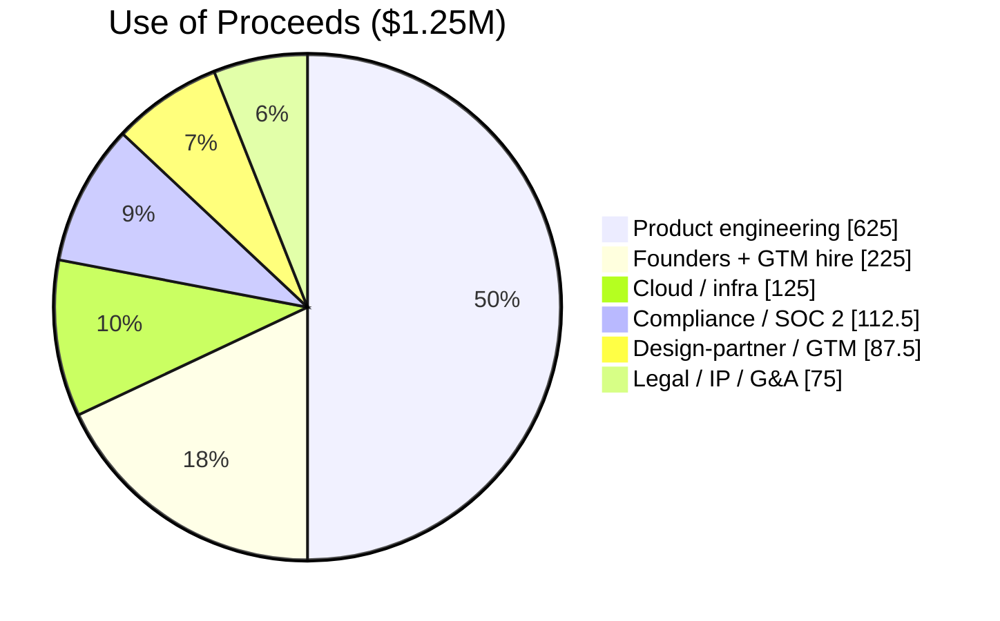

# 01 — Executive Summary

← [Index](00-README.md)

> ⚠️ **Stage disclosure.** Doxa is pre-seed and pre-product: we have compliance-grade infrastructure and
> architecture specs, not shipped product or revenue. Figures are illustrative; see [90-financial-model.md](90-financial-model.md).

## Doxa — The Trust Layer for Enterprise AI

**The problem.** Enterprises and governments are racing to put AI on top of their data — but they cannot
safely do so, because they cannot *prove* governance to a regulator. AI agents need business context
(definitions, lineage, ownership, quality) to be useful; regulated organizations additionally need every
AI access to that context to be **governed, sovereign, and recorded in a tamper-evident audit trail**.
Today's data-catalog and AI-governance tools deliver context but treat audit, isolation, and data
sovereignty as afterthoughts. **AI is scaling faster than compliance can keep up.**

**The solution.** Doxa is a compliance-grade **data & AI governance platform** — catalog, lineage, policy,
and "context for AI" — built on a **trust spine** competitors lack: an immutable, cryptographically signed
(SHA-256) WORM audit ledger, database-per-tenant isolation, customer-managed encryption, and a sovereign /
air-gapped deployment option. Doxa lets organizations give AI the context it needs **and** hand an auditor a
signed record of exactly what the AI saw and why it was allowed.

> *Atlan gives AI context. Doxa gives AI context you can put in front of an auditor.*

**Why now.** Three forces converge: (1) enterprise AI adoption is outpacing governance; (2) AI/data
regulation is tightening across jurisdictions; (3) regulated and public-sector buyers cannot adopt AI
without demonstrable auditability and sovereignty — a gap incumbents have not closed.

**Market.** We target security-conscious private-sector enterprises and **government & public sector**
(healthcare, financial services, defense, and critical infrastructure as illustrative sub-segments). The
opportunity sits at the intersection of the data-governance, AI-governance, and GRC software markets — a
multi-billion-dollar TAM (see [03-market-analysis.md](03-market-analysis.md)).

**Product / business model.** Enterprise SaaS subscription across **three tiers** — Essentials,
Enterprise, and **Sovereign** (air-gapped / government) — that monetize the
isolation → sovereignty → air-gap spectrum where our moat is strongest (see [05-business-model.md](05-business-model.md)).

**Traction = asset traction (honest framing).** We have not shipped product. What we *have* built is the
hardest part to retrofit for regulated buyers: a documented, production-grade **compliance and security
architecture** — immutable WORM audit pipeline, cryptographic-shred tenant offboarding, database-per-tenant
isolation, zero-trust edge, multi-region DR (RTO<1h/RPO<1min), and SOC 2 / HIPAA / NIST control mappings
(see [`../spec/doxa-enterprise-architecture-compliance-spec.md`](../spec/doxa-enterprise-architecture-compliance-spec.md)).
This is the moat we build the product on.

**Differentiation (four pillars).** (1) Immutable, signed audit ledger; (2) data sovereignty / air-gap;
(3) database-per-tenant isolation + cryptographic-shred certified offboarding; (4) control-mapped by
construction (SOC 2 / HIPAA / NIST). Details in [04-product.md](04-product.md).

## The ask

**Raising $1.25M pre-seed** (range $1.0–1.5M; SAFE) for **~18 months** of runway to ship the MVP, land
3–4 design partners, convert the first paid logos, and begin SOC 2 readiness. *(Source: [90](90-financial-model.md).)*

### Use of proceeds *(source: [90 §F](90-financial-model.md#f-use-of-proceeds-125m))*

### Financial snapshot *(illustrative — source: [90](90-financial-model.md))*

| Metric | Y1 | Y3 | Y5 |
|---|---|---|---|
| Ending ARR | ~$0.1M | ~$1.8M | ~$9.5M |
| Customers (cumulative) | 2 | 20 | 76 |
| Gross margin | 60% | 75% | 85% |
| NRR | 105% | 115% | 125% |
| Headcount | 6 | 22 | 57 |

**Team.** Founding team of two (representative profiles in [08-management-team.md](08-management-team.md)):
a CEO with regulated-SaaS go-to-market experience and a CTO who authored Doxa's compliance architecture.

**Vision.** Become the system of record for *trustworthy AI access to enterprise and government data* — the
layer every regulated organization runs between its data and its AI.
