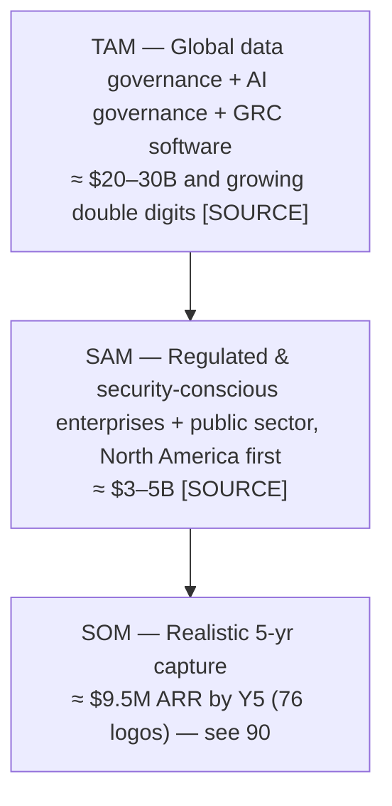

# 03 — Market Analysis

← [Index](00-README.md)

## The problem: the AI trust gap

Every enterprise wants AI on its data. Regulated and security-conscious organizations cannot proceed
because they cannot answer three questions to a regulator's satisfaction:

1. **Did the AI have the right context?** (definitions, lineage, quality)
2. **Was it allowed to access that data?** (policy, persona, purpose)
3. **Can you prove what it accessed, immutably?** (signed, tamper-evident audit)

Adapting Atlan's framing — *"your AI doesn't know your business"* — Doxa's framing is sharper for regulated
buyers: **"your AI isn't governed, sovereign, or auditable."**

## Market sizing (TAM / SAM / SOM)

> Methodology: top-down from adjacent software categories (data governance/catalog + AI governance + GRC),
> cross-checked bottom-up (target logo count × ACV from [90](90-financial-model.md)). All figures are
> assumptions; category sizes carry `[SOURCE: analyst report]` placeholders to be filled at diligence.

| Layer | Definition | Illustrative size |
|---|---|---|
| **TAM** | Global spend on data governance/catalog + AI governance + GRC software | ~$20–30B `[SOURCE]` |
| **SAM** | Regulated + security-conscious enterprises & government, North America first, that need auditable AI governance | ~$3–5B `[SOURCE]` |
| **SOM** | What Doxa can realistically win in 5 years | ~$9.5M ARR by Y5 *(source: [90 §B](90-financial-model.md#b-revenue-build))* |

## Target segments

1. **Security-conscious private-sector enterprises** (primary, cross-industry): data-sensitive organizations
   adopting AI — illustrative sub-segments: **healthcare & life sciences** (HIPAA/HITRUST), **financial
   services** (SOC 2, FINRA, GLBA, PCI-DSS), and **critical infrastructure / energy** (NERC CIP).
2. **Government & public sector** (primary): agencies and contractors needing FedRAMP/NIST 800-53 alignment
   and sovereign deployment. Longer cycles, higher ACV, strong moat (ATO + integration lock-in).

## Customer personas

| Persona | Role in deal | Goals | Pains Doxa removes |
|---|---|---|---|
| **CISO / Head of Security & Compliance** | Economic buyer | Adopt AI without expanding attack surface or audit risk | Immutable audit ledger; sovereignty; control-mapped posture |
| **Chief Data Officer / Data Governance lead** | Champion | Trusted, governed data for AI | Catalog, lineage, policy, certification |
| **AI Platform / ML lead** | Technical buyer | Ship agents fast with safe context | MCP/SQL/API activation + governed access |
| **Government CIO / Agency compliance officer** | Buyer (gov) | ATO-ready, sovereign AI governance | Air-gapped tier, NIST/FedRAMP path |
| **Internal Auditor / Risk** | Influencer/blocker | Provable controls | Signed, regulator-presentable audit trail |
| **Data Steward** | User | Classify, certify, curate | Workflow + AI-drafted context to review |

> Versus Atlan, Doxa shifts the **economic buyer toward the CISO / compliance office** and elevates the
> auditor from blocker to advocate.

## Procurement reality (a moat, not just friction)

Regulated and government procurement (security questionnaires, BAAs, ATO/FedRAMP) is slow — but once Doxa is
embedded as the system of record for AI access, switching costs are very high. We turn compliance friction
into **defensibility**: shorter security reviews (control-mapped by construction) become a sales accelerant,
and embeddedness becomes retention.

## Competitive landscape

| Competitor | Category | Strength | Where Doxa wins |
|---|---|---|---|
| **Atlan** (the model) | Catalog / active metadata / "Context for AI" | Catalog & AI-context, SaaS-first | Immutable audit, sovereignty/air-gap |
| **Collibra** | Data governance/catalog incumbent | Enterprise breadth | AI-native + immutable audit |
| **Alation** | Data catalog/governance | Discovery | Audit + sovereignty + AI governance |
| **Microsoft Purview** | Azure-native governance | Bundled with Azure | Cross-estate + immutable AI-access ledger (also interop partner) |
| **Databricks Unity Catalog / Snowflake Horizon** | Platform-native governance | Deep in their platform | Cross-platform + sovereign audit (layer on top) |
| **OneTrust** | GRC / privacy / AI governance | Compliance workflows | Real catalog/lineage + data-access audit |
| **Credo AI / Holistic AI** | AI-governance pure-plays | Model/policy risk | Data catalog/lineage + immutable data-access audit |
| **Drata / Vanta-adjacent** | Compliance automation (GRC) | Certification evidence | AI/data governance substrate, not just cert |

**Positioning line:** *Atlan gives AI context. Doxa gives AI context you can put in front of an auditor.*

## SWOT

| Strengths | Weaknesses |
|---|---|
| Compliance spine (immutable audit, sovereignty, isolation) hard to retrofit | Pre-product; no shipped features, revenue, team, or logos yet |
| Control-mapped architecture shortens enterprise/gov reviews | Small team; long regulated/gov sales cycles |
| Clear, differentiated wedge (auditable + sovereign AI governance) | Category education required |

| Opportunities | Threats |
|---|---|
| AI-governance regulation wave + surging gov demand | Incumbents (Atlan/Collibra/Purview) add AI-governance/audit |
| Sovereign/air-gap gap unserved by SaaS-first vendors | Well-funded AI-governance startups |
| Azure co-sell + marketplace + GovCon channel | Certification cost/time (SOC 2 → FedRAMP) |

## Porter's Five Forces

| Force | Assessment | Rationale |
|---|---|---|
| **Threat of new entrants** | **Low–Med** | Compliance/certification cost + immutable-audit architecture are high barriers. |
| **Buyer power** | **Med–High** | Enterprise/gov buyers negotiate hard; mitigated by switching costs once embedded. |
| **Supplier power** | **Low–Med** | Cloud (Azure) concentration; otherwise commodity inputs. |
| **Substitutes** | **Med** | DIY governance, platform-native tools; weak on cross-estate + immutable audit. |
| **Rivalry** | **High** | Active category (Atlan/Collibra/Purview); Doxa differentiates on audit + sovereignty. |
