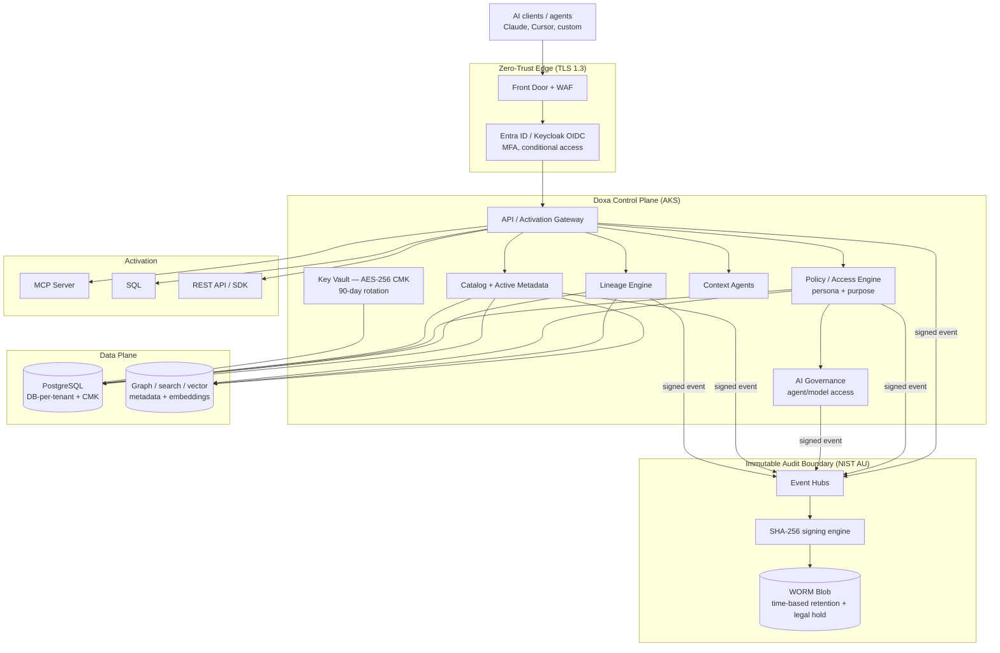
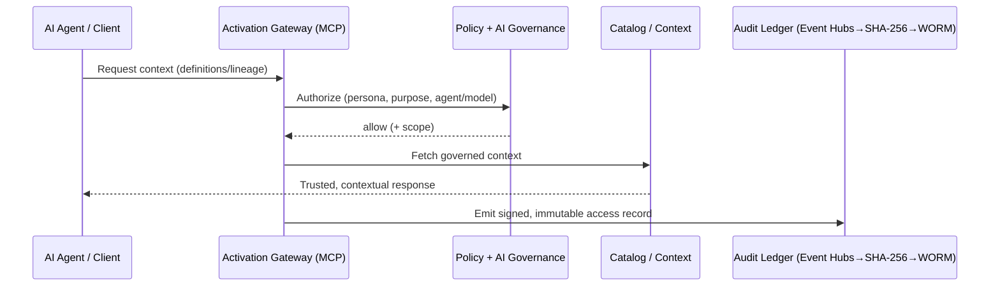
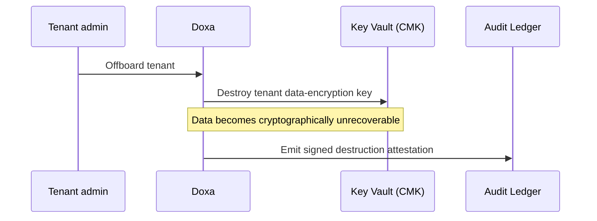
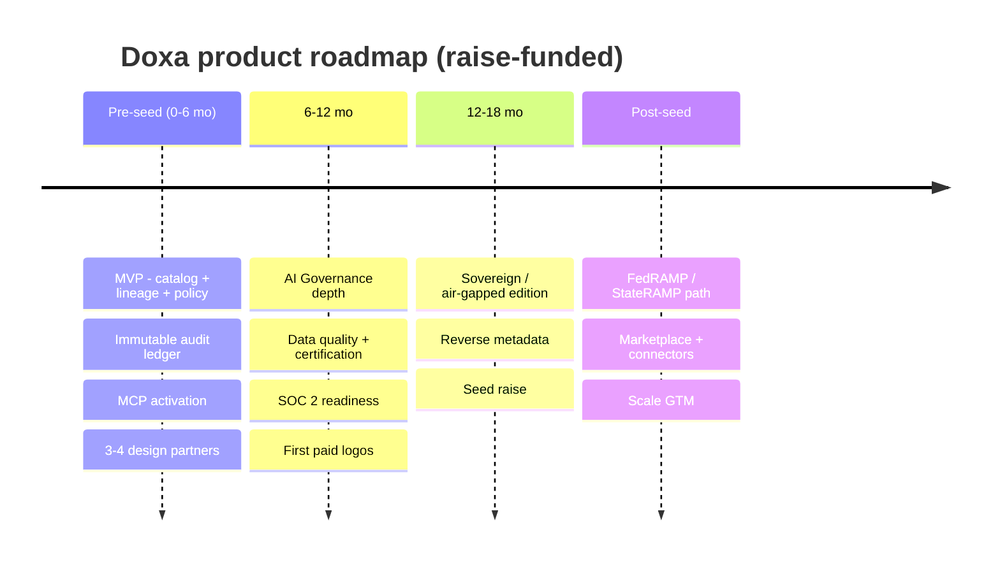

# 04 — Product

← [Index](00-README.md)

## Vision

**Doxa — The Trust Layer for Enterprise AI.** A compliance-grade data & AI governance platform that unifies
metadata, governs access, activates context to AI, and records every interaction in a tamper-evident ledger.
Modeled on [Atlan](https://atlan.com/)'s layered platform, with a fifth, differentiating layer Atlan lacks:
a **Compliance & Sovereignty substrate**.

## Capability map (layers)

| Layer | Capabilities | Doxa difference |
|---|---|---|
| **Foundation** | Catalog, active metadata, search/discovery, business glossary, classification/PII detection | Parity with catalog incumbents |
| **Intelligence** | Automated lineage & impact analysis, data quality, certification workflows | Parity, AI-native |
| **AI / Context** | "Context for AI": context agents (draft descriptions/terms/metrics), context engineering | Parity with Atlan |
| **Activation** | MCP server, SQL interface, REST API, SDK, reverse metadata | Parity, governed |
| **Compliance & Sovereignty (Doxa-only)** | **Immutable signed audit ledger**, **DB-per-tenant isolation**, **CMK encryption**, **crypto-shred offboarding**, **sovereign/air-gapped deployment**, **control-mapping (SOC 2/HIPAA/NIST)** | **The moat** |

### The fifth context layer
Atlan models four context layers (user, knowledge, meaning, data). Doxa adds a fifth: **provenance / audit
context** — *trace every AI answer to an immutable, signed record.*

## Architecture (centerpiece)

The product fuses an Atlan-style governance platform with Doxa's existing compliance pipeline: **every layer
emits to an immutable, signed audit ledger.**

*Compliance details grounded in [`../spec/doxa-enterprise-architecture-compliance-spec.md`](../spec/doxa-enterprise-architecture-compliance-spec.md).*

## Feature set / modules

| Module | What it does |
|---|---|
| Catalog & active metadata | Ingest, unify, search, discover assets across the estate |
| Lineage & impact analysis | Asset+process lineage (incl. column-level), upstream/downstream impact |
| Business glossary | Terms/categories linked to assets; meaning for humans + AI |
| Classification / PII detection | Auto-detect sensitive data; propagate tags along lineage |
| Policy & access | Persona (who) + purpose (why) policies; allow/deny, masking |
| **AI Governance** | Which agents/models may access which context; guardrails; logged decisions |
| **Context activation** | MCP server, SQL, REST API, SDK; reverse metadata into BI/Slack |
| **Immutable Audit Ledger** | Signed, WORM, regulator-presentable record of every access/decision |
| **Sovereign deployment** | Single-tenant / air-gapped / in-region for gov & highest-sensitivity |

## Key runtime flows

**AI access with signed audit (the differentiator):**

**Certified tenant offboarding (cryptographic shred):**

## Technical stack

| Layer | Technology |
|---|---|
| Orchestration | .NET 10 + **.NET Aspire** |
| Frontend | Blazor Server (web console) |
| Identity | **Keycloak OIDC** (dev) / Microsoft Entra ID (prod), audience-scoped tokens |
| Data | **PostgreSQL** — DB-per-tenant (prod) / RLS (dev); Redis cache |
| Metadata substrate (to build) | Graph + search + vector indexes |
| Cloud | Azure: **AKS**, PostgreSQL Flexible Server, Front Door + WAF, Event Hubs, **Key Vault (AES-256 CMK, 90-day rotation)**, **immutable WORM Blob**, Sentinel |
| Observability | OpenTelemetry → Azure Monitor; Sentinel SIEM |
| Resilience | Polly; multi-region active-passive (RTO<1h / RPO<1min); 99.99% HA target |
| Activation | MCP server, SQL, REST API, SDK |

## Intellectual property

- **Trade secrets:** the signed-audit-ledger + sovereign-tenant architecture and control-mapping framework.
- **Patents (provisional):** immutable, signed **audit ledger of AI/data-context access** with destruction attestation.
- **Trademarks:** "Doxa," "The Trust Layer for Enterprise AI."
- **Open source (defensive):** connectors / MCP adapters, to drive adoption while keeping the trust spine proprietary.

## Roadmap

Roadmap reuses Atlan's phase skeleton, re-sequenced for a two-founder pre-seed reality (see
[09](09-financial-plan.md) for the milestone-to-funding mapping).
