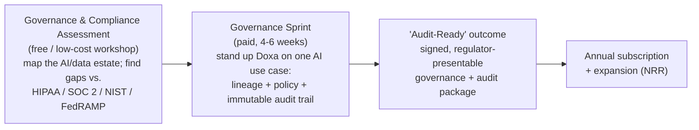

# 06 — Go-to-Market & Marketing

← [Index](00-README.md)

## GTM thesis

Sell the **audit-ready outcome**, not features. Regulated and government buyers greenlight AI only when they
can hand a regulator proof of governance. Doxa's deliverable is that proof: a signed, immutable audit trail
plus a control-mapped governance posture.

## The motion (adapted from Atlan's Workshop → Sprint)

Mirrors Atlan's "Workshop → Sprint → first value in weeks," but the deliverable is **compliance evidence**,
which is what regulated/government buyers actually need to adopt AI. The paid Sprint is also early revenue and
the primary design-partner mechanism.

## Sales motion (by stage)

1. **Founder-led (pre-seed):** founders run Assessments and Sprints directly with 3–4 design partners.
2. **Design-partner program:** discounted/co-developed deployments → referenceable logos + case studies.
3. **First paid logos:** convert design partners + inbound from content/thought leadership.
4. **Repeatable mid-market regulated:** first GTM/solutions hire; standardized Assessment → Sprint playbook.
5. **Public sector via partners:** GovCon integrators and primes carry Doxa through ATO/FedRAMP procurement.

## Channels

- **Direct / founder-led** (early).
- **Design-partner program** (named placeholders; logos for proof).
- **Azure Marketplace** — procurement ease; Doxa is Azure-native (co-sell motion).
- **GovCon integrators & primes** — public-sector reach, ATO/FedRAMP navigation.
- **Compliance & audit firms** — channel + third-party credibility.
- **Governance-interop partners** — Microsoft Purview / Unity Catalog / Snowflake Horizon (layer-on-top, like Atlan).

## Partnerships

| Partner type | Why |
|---|---|
| **Microsoft / Azure** | Native platform; co-sell, Marketplace, BAA/compliance alignment |
| **GovCon integrators** | Public-sector access + ATO/FedRAMP sponsorship |
| **Compliance/audit firms** | Credibility + referral channel into CISO/compliance offices |
| **Catalog/governance platforms** | Interop (layer on top) reduces "rip-and-replace" objection |

## Marketing strategy

- **Positioning / messaging house:** "The Trust Layer for Enterprise AI"; lead message — *"Give AI context
  you can put in front of an auditor."*
- **Content engine:** AI-governance & auditability thought leadership; **published control-mapping guides**
  (SOC 2 / HIPAA / NIST → AI access) as lead magnets; reference architectures.
- **Demand gen:** webinars and communities for CISOs/compliance officers; presence at security & public-sector
  events (e.g., RSA, gov/public-sector summits).
- **Brand / credibility assets:** SOC 2 status, published control mappings, design-partner case studies,
  compliance badges (vs. Atlan's analyst-badge wall — Doxa leads with compliance proof).
- **Marketing site:** reuse Atlan's information architecture (product / customers / resources / company), but
  swap analyst-only proof for **compliance badges + auditor/CISO testimonials**.

## Funnel & KPIs *(targets tie to the logo ramp in [90 §B](90-financial-model.md#b-revenue-build))*

| Stage | Metric | Early target |
|---|---|---|
| Assessment → Sprint | conversion | 40–60% |
| Sprint → annual subscription | conversion | 50%+ |
| Sales cycle | length | private ~3–6 mo; gov 9–18 mo |
| Expansion | NRR | 105% → 125% over 5 yr |
