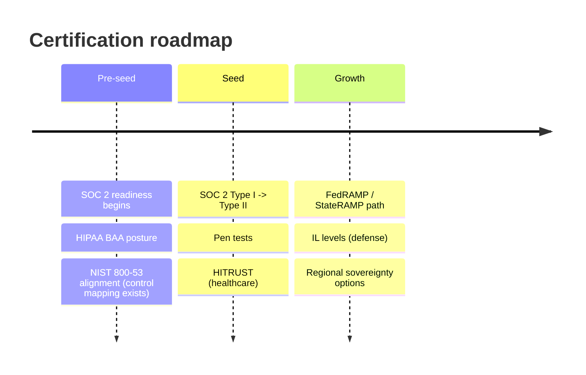

# 07 — Operations Plan

← [Index](00-README.md)

## Build & delivery

- **Build on the existing scaffold.** The MVP extends the current .NET 10 / Aspire solution (Web, API,
  AppHost) rather than starting from zero — the compliance/identity plumbing already exists.
- **Engineering practices** (specified in repo): OIDC-secured CI/CD, SAST/SCA in the pipeline, trunk-based
  development, automated tests (the repo already has API authorization + AppHost resource tests).
- **Agile cadence:** 2-week sprints; design-partner feedback drives the backlog; quarterly roadmap reviews.

## Cloud & infrastructure operations

- **Azure-native run model:** AKS (multi-AZ, autoscale at 70% utilization), PostgreSQL Flexible Server,
  Front Door + WAF, Key Vault (AES-256 CMK, 90-day rotation), Event Hubs, immutable WORM Blob, Sentinel.
- **Resilience:** active-passive multi-region (East US 2 primary, Central US failover), **RTO<1h / RPO<1min**,
  **99.99%** HA target *(source: [`../spec`](../spec/doxa-enterprise-architecture-compliance-spec.md))*.
- **Cost posture:** the CMK/HA/DR/Sentinel premium is budgeted as a distinct cloud line *(source: [90 §D](90-financial-model.md#d-operating-expense-budget))*.

## Security operations

- **SIEM/SOAR:** Microsoft Sentinel with automated incident-response playbooks (IP block → session
  revocation → SOC notification) and KQL cross-tenant anomaly hunting — all already specified in
  [`../plan/automated-incident-response-playbook.md`](../plan/automated-incident-response-playbook.md) and
  [`../plan/enterprise-governance-security-operations-plan.md`](../plan/enterprise-governance-security-operations-plan.md).
- **Tenant offboarding:** certified **cryptographic-shred** runbook with destruction attestation.
- **Audit:** immutable, SHA-256-signed WORM ledger under legal hold (no tier/admin can alter it).

## Compliance & certification roadmap

| Framework | Status today | Plan |
|---|---|---|
| SOC 2 Type II | Control mappings documented | Readiness in pre-seed; Type I → Type II by seed |
| HIPAA (§164.312) | Mapped | BAA posture; HITRUST for healthcare |
| NIST 800-53 (AU) | Audit pipeline mapped | Maintain; basis for FedRAMP |
| FedRAMP / StateRAMP | Not started | Post-seed, partner-sponsored (gov motion) |

## Customer support & success

- **Support tiers** matched to subscription (standard → priority + CSM → dedicated).
- **Onboarding** via the Governance Sprint; knowledge base + control-mapping guides.
- **Success:** drive expansion (NRR) through additional BUs/use cases.

## Key processes & vendors

| Area | Vendors / tools |
|---|---|
| Cloud | Microsoft Azure (primary) |
| Identity | Keycloak (dev) / Microsoft Entra ID (prod) |
| Audit firm | `[PLACEHOLDER: SOC 2 auditor]` |
| Pen testing | `[PLACEHOLDER: security firm]` |
| Observability | OpenTelemetry, Azure Monitor, Sentinel |

## Org & facilities

Remote-first, US-based; data-residency commitments per tier; minimal physical footprint. Operational risks are
tracked in the [risk register](10-appendix.md).
