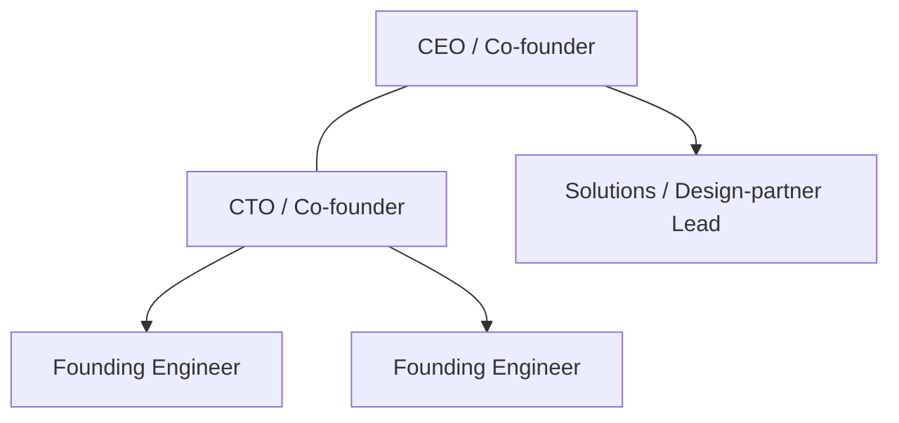

# 08 — Management Team

← [Index](00-README.md)

> ⚠️ **Representative profiles — illustrative, not real individuals.** Doxa is pre-seed; the team below
> describes the roles and backgrounds the company intends to fill (some via the founders, some via the raise).
> Replace `[PLACEHOLDER]` entries with real bios before any external use.

## Founding team (representative)

| Role | Representative background | Responsibility |
|---|---|---|
| **CEO / Co-founder** `[PLACEHOLDER]` | Regulated-SaaS go-to-market; sold into CISO/compliance buyers in healthcare/financial/gov | Vision, fundraising, GTM, design-partner relationships |
| **CTO / Co-founder** `[PLACEHOLDER]` | Authored Doxa's compliance architecture; cloud security + .NET/Azure depth | Product & technical execution, the trust spine, security |

## Key early hires (post-raise) *(tie to [90 §C](90-financial-model.md#c-headcount-plan))*

| Hire | When | Why |
|---|---|---|
| Founding engineers (2) | Pre-seed | Build the MVP on the existing scaffold |
| Solutions / design-partner lead | Pre-seed (the "+1 GTM" hire) | Run Assessments & Governance Sprints |
| Compliance / security lead | ~Y2 | SOC 2 → FedRAMP program ownership |
| First sales + marketing | ~Y2 | Repeatable funnel beyond founder-led |

## Advisors & board (representative slots)

- **Regulated-industry CISO advisor** `[PLACEHOLDER]` — buyer credibility, design-partner intros.
- **Public-sector / GovCon advisor** `[PLACEHOLDER]` — ATO/FedRAMP and integrator channel.
- **GTM / SaaS advisor** `[PLACEHOLDER]` — pricing, funnel, fundraising.
- **Board (pre-seed):** founders + lead investor seat at seed.

## Near-term org

## Compensation philosophy

Below-market cash + meaningful equity at pre-seed; standard 4-year vesting / 1-year cliff; an option pool sized
at the seed round (reflected in the cap table, [09](09-financial-plan.md)).

## Hiring gaps (honest)

This round must fund: 2 founding engineers, 1 solutions/design-partner lead, and the start of a
compliance/security function. Sales/marketing scale is a **seed-round** objective, not pre-seed.
