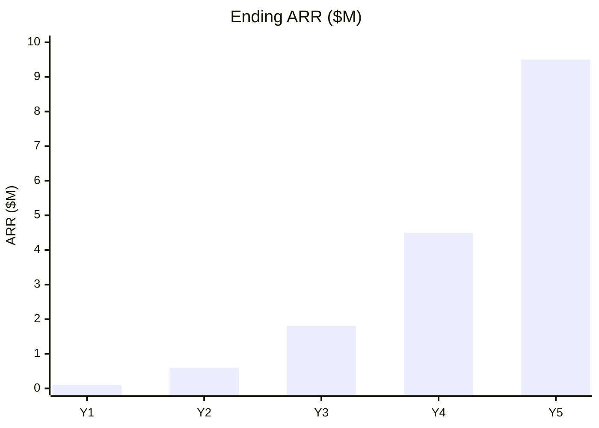
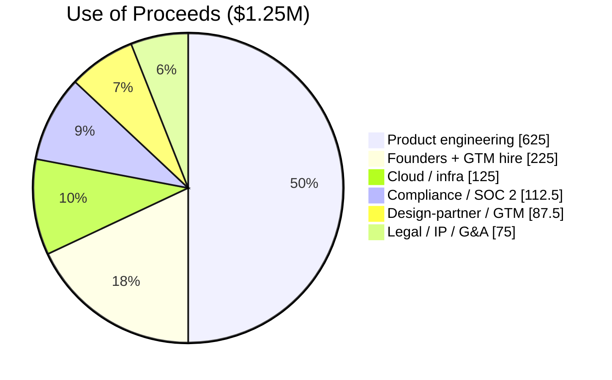

# 90 — Financial Model (Source of Truth)

> **This file is the single numeric source of truth.** Every financial figure quoted anywhere else in the
> business plan (executive summary, business model, financial plan, prospectus) is sourced from here. If a
> number changes, change it **here** and update references.
>
> **All figures are illustrative pre-seed assumptions for a pre-product company. They are not forecasts of
> actual results.** A live spreadsheet (`business-plan/model.xlsx`) is intended to back this file; until then
> the tables below are the model.

**Base year:** 2026 · **Horizon:** 2026–2030 (Y1–Y5) · **Currency:** USD · **Entity:** Delaware C-Corp.

---

## A. Key Assumptions

| Assumption | Value | Rationale |
|---|---|---|
| Pre-seed raise | **$1.25M** (range $1.0–1.5M) | Midpoint; funds MVP + design partners + SOC 2 readiness. |
| Instrument | SAFE, post-money cap `[PLACEHOLDER: ~$8–10M]` | Standard pre-seed; cap set at term-sheet. |
| Target runway | **~18 months** | Reach seed milestones before next raise. |
| Y1 posture | Build + 3–4 design partners (pilots) | Pre-product; minimal paid ARR until late Y1/Y2. |
| Blended new-logo ACV | $40K → $120K (Y1→Y5) | Mix shifts toward Enterprise/Sovereign over time. |
| Gross margin | 60% → 85% (Y1→Y5) | Services-heavy early; SaaS-dominant later. |
| Gross logo churn | 10% → 6% | High-switching-cost product in regulated accounts. |
| Net revenue retention (NRR) | 105% → 125% | Land-and-expand across business units / agencies. |

---

## B. Revenue Build

| | Y1 (2026) | Y2 (2027) | Y3 (2028) | Y4 (2029) | Y5 (2030) |
|---|---|---|---|---|---|
| Design-partner pilots | 3–4 | — | — | — | — |
| New paying logos | 2 | 6 | 14 | 26 | 40 |
| Cumulative logos (net of churn) | 2 | 8 | 20 | 42 | 76 |
| Blended new ACV | $40K | $55K | $75K | $100K | $120K |
| **Ending ARR** | **~$0.1M** | **~$0.6M** | **~$1.8M** | **~$4.5M** | **~$9.5M** |
| Subscription % of revenue | 40% | 70% | 85% | 90% | 92% |
| Services % of revenue (Sprints) | 60% | 30% | 15% | 10% | 8% |

ARR is intentionally modest in Y1–Y2 (honest for pre-product) and inflects in Y3–Y5 as the
regulated/government motion matures and Sovereign-tier deals close. Canonical Y5 ARR point estimate = **$9.5M**.

### B.1 ARR ramp (illustrative)

### B.2 ARR waterfall (drivers)
- **New ARR** from new logos (table B) + **Expansion ARR** (NRR >100%) − **Churned ARR** (gross logo churn).
- Y3→Y5 expansion increasingly dominates as installed base grows (NRR 115%→125%).

---

## C. Headcount Plan

| Role band | Y1 | Y2 | Y3 | Y4 | Y5 |
|---|---|---|---|---|---|
| Founders | 2 | 2 | 2 | 2 | 2 |
| Engineering | 2 | 5 | 9 | 15 | 22 |
| Product / Design | 0 | 1 | 2 | 3 | 4 |
| GTM (Sales / Marketing / CS) | 0 | 2 | 5 | 11 | 20 |
| Compliance / Security | 0 | 1 | 2 | 3 | 4 |
| G&A | 0 | 1 | 2 | 3 | 5 |
| **Total** | **6** | **12** | **22** | **37** | **57** |

Y1 stays at 6 to fit the $1.25M envelope; the round funds primarily product engineering + the first GTM/solutions hire.

---

## D. Operating Expense Budget

| Category (annual, illustrative) | Y1 | Y2 | Y3 | Y4 | Y5 |
|---|---|---|---|---|---|
| Personnel (≈60–70% of opex) | $0.62M | $1.5M | $3.1M | $6.0M | $9.8M |
| Cloud / infrastructure (Azure, CMK/HA/DR/Sentinel premium) | $0.12M | $0.25M | $0.5M | $0.9M | $1.5M |
| Compliance & audit (SOC 2, pen tests, later FedRAMP advisory) | $0.11M | $0.2M | $0.35M | $0.6M | $0.9M |
| Sales & marketing programs | $0.03M | $0.15M | $0.45M | $1.1M | $1.9M |
| Software / tools | $0.02M | $0.06M | $0.12M | $0.22M | $0.35M |
| Legal / IP / G&A / insurance | $0.05M | $0.12M | $0.25M | $0.45M | $0.7M |
| **Total opex** | **~$0.95M** | **~$2.3M** | **~$4.8M** | **~$9.3M** | **~$15.2M** |

---

## E. Cash & Runway (pre-seed)

| | Y1 |
|---|---|
| Opening cash (post-raise) | $1.25M |
| Revenue (mostly services/pilots) | ~$0.08M |
| Total opex | ~$0.95M |
| **Net burn (Y1)** | **~$0.87M** |
| Avg monthly burn (Y1) | ~$55–75K (ramps with hires) |
| **Runway on $1.25M** | **~17–18 months** |
| Next-raise trigger | ~6 months runway left (≈ month 12), with ≥$0.6M ARR + design-partner proof |

> The pre-seed round funds the company to **seed-stage milestones** (MVP shipped, 3–4 design partners,
> first paid logos, SOC 2 readiness underway), de-risking a larger seed/Series A.

---

## F. Use of Proceeds ($1.25M)

| Category | % | $ |
|---|---|---|
| Product engineering (MVP) | 50% | $625K |
| Founders + first GTM/solutions hire | 18% | $225K |
| Cloud / infrastructure | 10% | $125K |
| Compliance & SOC 2 readiness | 9% | $112.5K |
| Design-partner / GTM motion | 7% | $87.5K |
| Legal / IP / G&A / buffer | 6% | $75K |
| **Total** | **100%** | **$1.25M** |

---

## G. SaaS Metrics Dashboard

| Metric | Y1 | Y2 | Y3 | Y4 | Y5 |
|---|---|---|---|---|---|
| Ending ARR | $0.1M | $0.6M | $1.8M | $4.5M | $9.5M |
| ARR growth | — | 6.0× | 3.0× | 2.5× | 2.1× |
| Gross margin | 60% | 68% | 75% | 82% | 85% |
| NRR | 105% | 110% | 115% | 120% | 125% |
| Gross logo churn | 10% | 9% | 8% | 7% | 6% |
| New-logo CAC (blended) | $35K | $45K | $55K | $55K | $50K |
| CAC payback (months) | ~30 | ~24 | ~18 | ~15 | ~13 |
| LTV : CAC | <1 | ~1.5 | ~2.5 | ~3.3 | ~4.0 |
| Rule of 40 (growth% + FCF margin%) | strongly negative | negative | approaching | improving | near/above 40 |

> Early-year CAC payback and LTV:CAC are deliberately unflattering — that is the honest reality of a
> pre-product, enterprise/government, long-cycle motion. The thesis is that **regulated switching costs +
> NRR** drive strong long-run unit economics once the base is installed.

---

## H. Scenarios

| Scenario | Y5 Ending ARR | Notes |
|---|---|---|
| **Base** (above) | ~$9.5M | Design-partner-led; Sovereign deals close from Y3. |
| **Conservative** | ~$6.5M | Slower gov/regulated cycles; ~30% lower; needs tighter burn / earlier seed. |
| **Upside** | ~$14M+ | One or more large Sovereign/government deals pull Y3–Y4 ARR up materially. |

---

## I. Charts / Tables Index

ARR ramp (B.1) · ARR waterfall (B.2) · headcount (C) · opex (D) · cash/runway (E) · use-of-proceeds pie (F) ·
SaaS metrics + LTV:CAC + Rule of 40 (G) · scenarios (H). A companion `model.xlsx` should generate live versions.

---

*All figures illustrative assumptions, not guarantees. See [10-appendix.md](10-appendix.md) assumptions log.*
