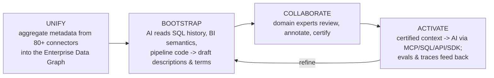
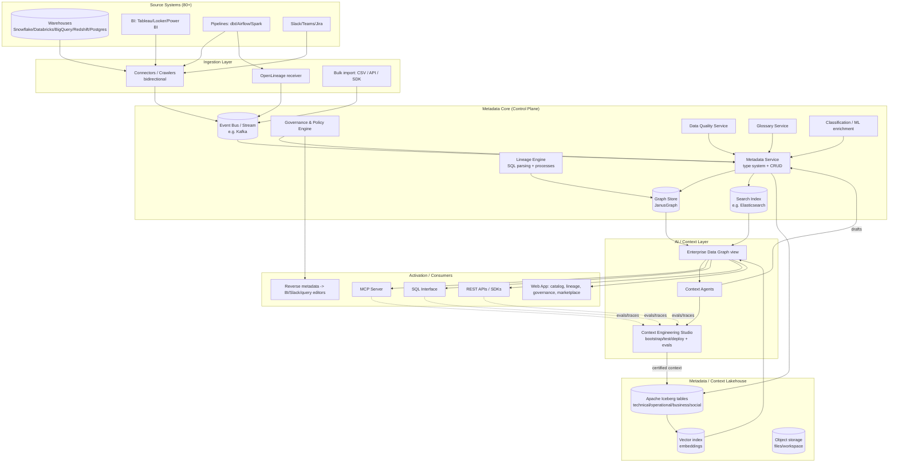
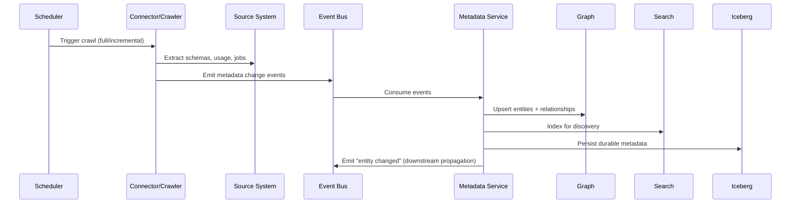
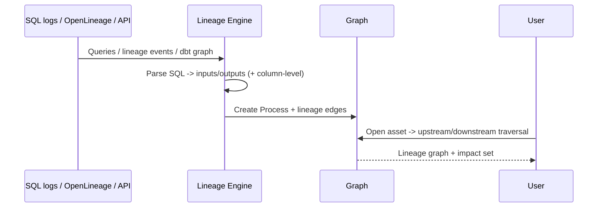
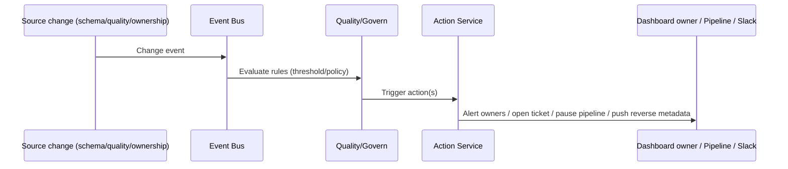
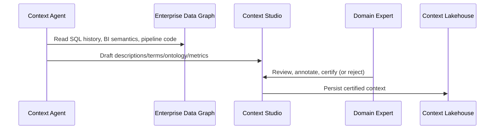
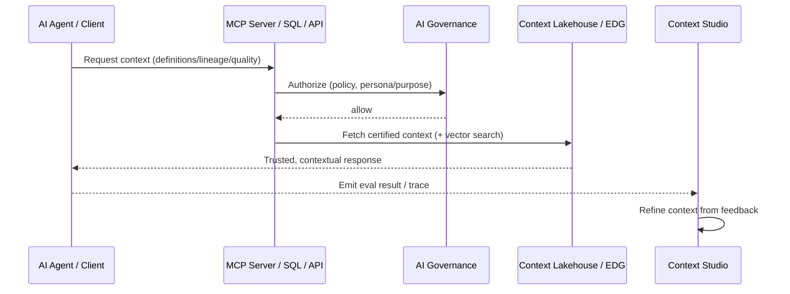
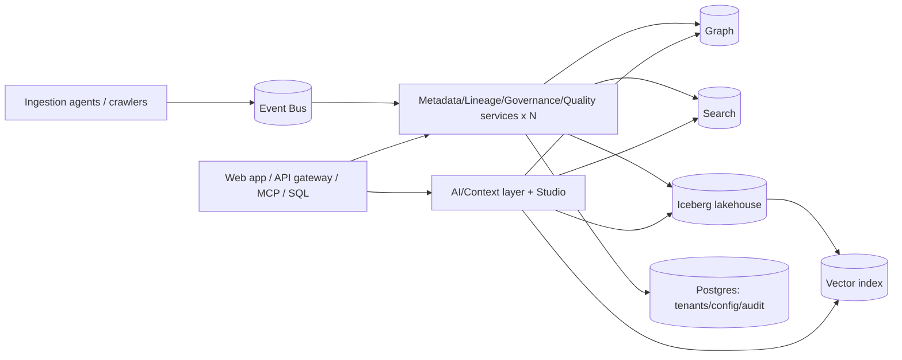

# Atlan Clone — Context Layer for AI / Active-Metadata Platform: Full Recreation Specification

> **Purpose.** Implementation-ready, **stack-agnostic** blueprint to recreate [Atlan](https://atlan.com/) end to end —
> both the **marketing website** and the **full platform/service**. Emphasis is **architecture & engineering**, and the
> framing follows the live site: a complete **enterprise data catalog / active-metadata / governance & lineage platform**
> headlined as **"The Context Layer for AI."** Coverage is **comprehensive and deep**.
>
> **Source material parsed (2026-06-14):** [atlan.com](https://atlan.com/),
> [Active Metadata 101](https://atlan.com/active-metadata-101/),
> [Data Lineage](https://atlan.com/data-lineage/),
> [Metadata Lakehouse](https://atlan.com/know/metadata-lakehouse/),
> [What is a Data Catalog](https://atlan.com/what-is-a-data-catalog/),
> [Atlan Docs](https://docs.atlan.com/).
> Observed implementation signals: **Apache Iceberg** metadata lakehouse, **JanusGraph** graph store (25–50M+ assets),
> **OpenLineage** ingestion, **Assets + Processes** lineage model, **pyatlan** SDK + REST APIs, **MCP server** activation.
> This spec abstracts technology so any stack can implement it; where a concrete engine is named it reflects Atlan's
> observed/likely choice and is offered as a reference, not a requirement.

---

## Table of Contents

1. [Product Overview & Positioning](#1-product-overview--positioning)
2. [Personas & Top-Level Use Cases](#2-personas--top-level-use-cases)
3. [Domain Glossary & Core Concepts](#3-domain-glossary--core-concepts)
4. [Conceptual Frameworks: Context Pipeline & Active Metadata](#4-conceptual-frameworks-context-pipeline--active-metadata)
5. [System Architecture](#5-system-architecture)
6. [Component Specifications](#6-component-specifications)
7. [Metadata Model](#7-metadata-model)
8. [Storage & Data Architecture](#8-storage--data-architecture)
9. [Key Runtime Flows](#9-key-runtime-flows)
10. [The AI / Context Layer](#10-the-ai--context-layer)
11. [API Surface & SDKs](#11-api-surface--sdks)
12. [Connectors & Integrations](#12-connectors--integrations)
13. [Governance, Security & Compliance](#13-governance-security--compliance)
14. [Observability & Audit](#14-observability--audit)
15. [Deployment & Operations](#15-deployment--operations)
16. [Configuration Reference](#16-configuration-reference)
17. [Marketing Website Recreation](#17-marketing-website-recreation)
18. [Suggested Repository Structure](#18-suggested-repository-structure)
19. [Implementation Roadmap](#19-implementation-roadmap)
20. [Non-Functional Requirements](#20-non-functional-requirements)
21. [Open Questions / Assumptions](#21-open-questions--assumptions)

---

## 1. Product Overview & Positioning

**What it is.** An **enterprise data catalog & active-metadata platform** that unifies metadata from across the data
estate into a single living graph, adds automated **lineage**, **governance**, **discovery**, **quality**, and a
**business glossary**, and — in its current positioning — **activates that context for AI** so agents can reason about
a company's specific data and business.

**Tagline.** *"The Context Layer for AI."*
**Hook.** *"Your AI doesn't know your business. Let's fix that."*

**Core thesis.** Enterprise AI fails not from weak models but from **missing business context** — definitions,
lineage, ownership, quality, and institutional knowledge. Atlan unifies metadata from **80+ systems** into an
**Enterprise Data Graph** and makes that context available to AI in real time (via **MCP server, SQL, APIs, SDKs**).

**Headline capabilities (full platform, AI-context framing on top):**

| Layer | Capability |
|-------|-----------|
| **Foundation (data catalog / active metadata)** | Metadata ingestion from 80+ sources; unified metadata store; search & discovery; automated **lineage**; **business glossary**; classification/tagging; **data quality**; **governance** & access policies; certification workflows. |
| **AI / Context layer (headline)** | **Enterprise Data Graph**; **Context Agents** (auto-generate descriptions, glossary terms, ontology, metrics, quality scores, READMEs); **Context Engineering Studio** (bootstrap/test/deploy business understanding); **Context Lakehouse** (Iceberg-native, graph + vector store engineered for AI). |
| **Activation** | **MCP server**, **SQL interface**, **REST APIs**, **SDKs**; reverse-metadata into BI/query/Slack; evals & traces feedback loop. |
| **Governance** | **Data Governance** + **AI Governance** modules; layers on top of Microsoft Purview / Snowflake Horizon / Databricks Unity Catalog. |
| **Extensibility** | **App Framework** (build custom apps, connectors, lineage). |

**Editions / business model.** Enterprise SaaS (no public pricing — "Book a Demo"); SaaS multi-tenant with options for
in-VPC/hybrid crawling. Recreate tiers: Starter/Team, Enterprise, plus a guided onboarding path (**Context Workshop →
Context Sprint**, "first value in weeks").

**Proof points to replicate on the site:** Gartner MQ Leader (Metadata Management 2025; D&A Governance 2026), Forrester
Wave Leader (Enterprise Data Catalogs 2024; Data Governance 2025), G2 leader badges; customers incl. Nasdaq, Mastercard,
Autodesk, HubSpot, Unilever, GM, Fox, NHS, Ralph Lauren, Workday, GitLab, Zoom.

---

## 2. Personas & Top-Level Use Cases

| Persona | Goals | Primary surfaces |
|---------|-------|------------------|
| **Data Engineer** | Automate lineage/discovery; trust upstream changes; impact analysis. | Lineage graph, asset pages, App Framework/SDK. |
| **Data Governance / Steward** | Enforce asset-level policies, classify sensitive data, run certification. | Governance console, glossary, policies, classifications. |
| **AI Platform Team** | Build/deploy agents fast with trusted context; wire MCP/SQL/API activation. | Context Studio, MCP server, evals/traces. |
| **Domain Expert / Analyst** | Review, annotate, certify AI-drafted context; define metrics. | Collaboration UI, glossary, Context Agents review. |
| **Business user (CS/Sales)** | Discover data, get trustworthy answers in context. | Data Marketplace/discovery, embedded context in BI/Slack. |
| **Security/Compliance** | Verify policies, audit access, ensure compliance. | Audit logs, access reviews, compliance reports. |

**Flagship use cases**
1. **Unify** metadata across warehouses/BI/pipelines → searchable catalog + lineage.
2. **Automated lineage & impact analysis** — trace any column/dashboard to source; alert owners on breaking changes.
3. **Governance at scale** — classify PII, apply policies, certify assets, satisfy audits.
4. **AI context activation** — agents query trusted definitions/lineage/quality via MCP/SQL/API to answer business questions correctly.
5. **Context engineering** — bootstrap context with AI, have humans certify, deploy to agents, measure accuracy with evals.

---

## 3. Domain Glossary & Core Concepts

- **Asset** — any catalogued metadata object: connection, database, schema, table, view, column, BI dashboard, report, dbt model, pipeline, ML feature, etc.
- **Process** — an activity that moves/transforms data (a SQL job, dbt run, pipeline). **Lineage = Assets linked by Processes.**
- **Typedef / Entity type** — schema of an asset type (attributes, relationships). Heritage: Apache Atlas-style type system.
- **Classification / Tag** — labels (e.g., `PII`, `Sensitive`) propagated along lineage.
- **Custom metadata ("badges"/attributes)** — user-defined attribute groups attached to assets.
- **Glossary / Term / Category** — business vocabulary; terms link to assets to give meaning.
- **Certification** — trust signal (`Draft`/`Verified`/`Deprecated`) on assets.
- **Active metadata** — metadata that continuously updates from real-time events and **acts** (alerts, tickets, propagation), vs passive periodic crawls.
- **Metadata types** — **technical** (schemas), **operational** (jobs/usage), **business** (definitions/ownership), **social** (conversations, popularity).
- **Enterprise Data Graph** — the unified living graph of all metadata + relationships across the estate.
- **Context** — the layered knowledge AI needs: **user**, **knowledge**, **meaning**, **data** context.
- **Context Agent** — AI teammate that drafts descriptions/terms/ontology/metrics/quality/README.
- **Context Lakehouse** — Iceberg-native store combining graph + files + vector search, engineered for AI consumption.
- **Activation** — exposing certified context to consumers via MCP/SQL/API/SDK and reverse-metadata into tools.
- **Reverse metadata** — pushing catalog context back into BI tools, query editors, Slack.
- **OpenLineage** — open standard for lineage events (Airflow, Spark, dbt Cloud, Astronomer).

---

## 4. Conceptual Frameworks: Context Pipeline & Active Metadata

### 4.1 The Context Pipeline (product narrative — 4 stages)

Guiding principle: *"AI draft is a starting point, not the final word."* Humans certify before production.

### 4.2 Active Metadata pillars (engineering framing — 4 functions)
1. **Collect** — always-on observation: query logs, lineage events, usage, conversations; ML classifies sensitive data and infers meaning.
2. **Activate** — turn intelligence into action: alert impacted dashboard owners, open remediation tickets, stop downstream pipelines before bad data spreads.
3. **Refine** — learn from user interactions; enrich metadata continuously.
4. **Exchange** — open, API-driven, **bidirectional** flow: lineage in BI tools, quality scores in query editors, definitions in Slack.

Active vs passive: event-driven propagation "within minutes, not on the next nightly crawl."

---

## 5. System Architecture

### 5.1 High-level architecture


### 5.2 Architectural principles
1. **Open substrate, not a silo.** Metadata stored on **open standards (Iceberg)**; any connected system can read/write.
2. **Graph at the center.** A property graph (**JanusGraph**) models assets + relationships + processes; scales to **25–50M+ assets**.
3. **Event-driven & bidirectional.** A stream/event bus drives near-real-time propagation and **reverse metadata**.
4. **Separation of services.** Ingestion, metadata/type system, search, lineage, governance, quality, glossary, classification are independent services around the graph/lakehouse.
5. **AI as a first-class consumer & producer.** Context Agents *write* drafts; humans certify; activation *serves* trusted context to AI.
6. **Human-in-the-loop.** Certification gates AI-drafted context before production.
7. **Portability.** Context "moves freely across agents, models, and clouds" — open APIs + MCP + Iceberg.

---

## 6. Component Specifications

### 6.1 Connectors / Crawlers (ingestion)
- **Bidirectional** connectors to 80+ systems; extract technical + operational metadata; push reverse metadata back.
- **Crawl modes:** scheduled full + incremental; **continuous** change detection (schema drift, new assets, usage).
- **OpenLineage receiver** consumes lineage events from Airflow/Spark/dbt Cloud/Astronomer.
- **Bulk ingestion:** CSV import, REST/SDK programmatic upserts.
- **In-VPC option:** crawler can run inside the customer network for secure extraction (metadata only).

### 6.2 Metadata Service + Type System
- Owns the **typedef/entity** model (asset types, attributes, relationships), CRUD, validation, versioning.
- Writes to **graph** (relationships), **search index** (discovery), and **Iceberg** (durable open store).
- Emits change events to the bus for downstream propagation.

### 6.3 Graph Store
- Property graph (**JanusGraph** reference) holding assets, processes, lineage edges, classifications, glossary links.
- Backing storage + index per JanusGraph (e.g., Cassandra/HBase/ScyllaDB + Elasticsearch) — implementation choice.

### 6.4 Search & Discovery
- Full-text + faceted search over assets (name, description, tags, type, owner, certification, popularity).
- Powers catalog discovery, the **Data Marketplace**, and ranked results (social signals boost popular/certified assets).

### 6.5 Lineage Engine
- Builds lineage by combining **Assets** (inputs/outputs) and **Processes** (transforms) via **SQL parsing**, native connectors, OpenLineage, and open APIs.
- **Impact analysis:** upstream/downstream traversal; column-level lineage; "trace every AI answer to the truth."
- **Lineage Builder:** visual manual modeling; CSV bulk lineage; programmatic lineage via SDK.

### 6.6 Governance & Policy Engine
- Asset-level access policies; data masking/visibility; persona/purpose-based access; certification workflows.
- **AI Governance** module: policies for agent/model access to context; guardrails.
- Can **layer on** Microsoft Purview / Snowflake Horizon / Databricks Unity Catalog.

### 6.7 Data Quality Service
- Quality scores/metrics on assets; threshold breaches trigger **active-metadata actions** (alerts/tickets/pipeline stops).

### 6.8 Business Glossary
- Terms & categories; link terms to assets; ownership; approval workflow; surfaces meaning to humans and AI.

### 6.9 Classification / ML Enrichment
- ML to detect sensitive data (PII), infer business meaning, auto-suggest tags; propagate classifications along lineage.

### 6.10 Context Agents (AI)
- Auto-generate: descriptions, glossary terms, ontology, metrics, quality scores, README docs — by reading SQL query history, BI semantics, pipeline code.
- Output is **draft** pending human certification.

### 6.11 Context Engineering Studio
- Bootstrap, **test**, and deploy business understanding for AI; manage context for a use case; run **evals** and inspect **traces**; iterate.

### 6.12 Context Lakehouse
- **Iceberg-native** context store engineered for AI: combines **graph + file architecture + vector-native search**; the durable, portable substrate the EDG and AI consumers read.

### 6.13 App Framework (extensibility)
- Build custom apps, connectors, and lineage via REST APIs + SDKs; package and deploy integrations.

### 6.14 Activation Surfaces
- **MCP server** (AI clients/agents), **SQL interface**, **REST APIs**, **SDKs**, **reverse metadata** into BI/Slack/query editors.

### 6.15 Web Application
- Catalog/asset pages, lineage graph, glossary, governance console, Data Marketplace/discovery, Context Studio, admin.

---

## 7. Metadata Model

Apache Atlas-derived type system (reference model; names illustrative):

```
TypeDef(name, category[ENTITY|RELATIONSHIP|CLASSIFICATION|STRUCT|ENUM],
        superTypes[], attributeDefs[], relationshipDefs[])

Entity(guid, typeName, qualifiedName, attributes{}, status[ACTIVE|DELETED],
       createdBy, updatedBy, createTime, updateTime,
       classifications[], meanings[]/glossaryTermLinks[], customMetadata{}, certificateStatus)

# Asset entity hierarchy (examples)
Connection -> Database -> Schema -> Table -> Column
Connection -> BIServer -> Dashboard -> Report -> Field
Pipeline/dbtModel, MLFeature, etc.

Process(guid, typeName='Process', inputs[Entity], outputs[Entity], sql, code, runMetadata)
ColumnProcess(inputs[Column], outputs[Column])     # column-level lineage

Classification(typeName, propagate[bool], attributes{})    # e.g. PII, Sensitive
GlossaryTerm(guid, name, definition, categories[], assignedEntities[])
GlossaryCategory(guid, name, parent)
CustomMetadataDef(name, attributeDefs[])           # "badges"

Persona/Purpose(name, policies[])                  # access-control grouping
Policy(id, type[metadata|data], resources[], principals[], actions[], effect)
```

**Key relationships:** `Process.inputs/outputs` (lineage), `Entity.classifications` (propagated tags),
`Entity.meanings` (glossary links), `Entity.customMetadata` (badges), `Persona/Purpose → Policy` (access).

---

## 8. Storage & Data Architecture

| Concern | Store | Notes |
|---------|-------|-------|
| Relationships / lineage / graph traversal | **Graph DB (JanusGraph)** | assets, processes, edges; 25–50M+ assets. |
| Discovery / full-text / facets | **Search index (Elasticsearch-class)** | denormalized asset docs. |
| Durable open metadata | **Apache Iceberg lakehouse** | technical/operational/business/social metadata, raw + processed; open read/write. |
| AI retrieval | **Vector index** | embeddings over assets/terms/docs for semantic + RAG. |
| Files / workspace / artifacts | **Object storage (S3/GCS/Azure)** | docs, exports, app artifacts. |
| Events / propagation | **Event bus/stream (Kafka-class)** | drives active-metadata + reverse flow. |
| Operational/config | **Relational DB (Postgres-class)** | tenants, users, config, audit. |

The **metadata lakehouse** is the unifying substrate; graph + search + vector are derived/serving indexes kept in sync via the event bus.

---

## 9. Key Runtime Flows

### 9.1 Connector crawl / ingestion


### 9.2 Lineage construction & impact analysis


### 9.3 Active-metadata event propagation


### 9.4 Context bootstrap by AI + certification


### 9.5 Activation to AI (MCP/SQL/API) + feedback


---

## 10. The AI / Context Layer

- **Enterprise Data Graph** — the unified, queryable graph view assembled from graph + search + vector indexes; the substrate AI reads.
- **Context Agents** — generate drafts (descriptions, glossary, ontology, metrics, quality, README) from query history/BI/pipeline code.
- **Context Engineering Studio** — author, **test**, deploy context per use case; **evals** measure agent accuracy; **traces** explain answers; iterate.
- **Context Lakehouse** — Iceberg-native graph + file + **vector-native** search store engineered for AI consumption and portability.
- **The four context layers** to model (from the site's example "Who are our top customers this quarter?"):
  - **User context** (role-specific intent), **Knowledge context** (entity definitions), **Meaning context** (metric semantics, e.g. "top" = net ACV vs order count), **Data context** (which tables, how computed).
- **Feedback loop** — activation emits evals/traces back to Studio to refine context (closes the Context Pipeline).

---

## 11. API Surface & SDKs

**Authentication:** API tokens (bearer); SSO/SAML/OIDC for users; persona/purpose authorization.

**SDKs (reference):** **pyatlan** (Python), Java/Kotlin SDK; used for asset CRUD, search, lineage, custom metadata, packages.

**Representative REST endpoints** (versioned `/api/...`):
```
# Assets / entities
POST   /api/meta/entity/bulk            -> upsert entities
GET    /api/meta/entity/guid/{guid}
DELETE /api/meta/entity/guid/{guid}
# Search (DSL/index search)
POST   /api/meta/search/indexsearch     -> faceted/full-text asset search
# Type system
GET/POST /api/meta/types/typedefs
# Lineage
GET    /api/meta/lineage/{guid}?direction=UPSTREAM|DOWNSTREAM|BOTH&depth=
POST   /api/meta/lineage                -> programmatic lineage (process create)
# Classifications / glossary / custom metadata
POST   /api/meta/entity/guid/{guid}/classifications
GET/POST /api/meta/glossary             -> terms & categories
POST   /api/meta/custommetadata         -> custom metadata defs/values
# Governance
GET/POST /api/governance/policies | personas | purposes
# Webhooks / events
POST   /api/events/webhooks             -> register event subscriptions
# Activation
ALL    /mcp                             -> MCP server endpoint for AI clients
POST   /api/query/sql                   -> SQL interface over metadata/context
```

**Webhooks/events:** subscribe to entity/classification/lineage changes for reverse-metadata and automation.

**OpenLineage ingestion:** `POST /api/openlineage/events` (Marquez-compatible event format).

**App Framework:** package custom connectors/apps/lineage; deploy via APIs/SDK.

---

## 12. Connectors & Integrations

**80+ bidirectional connectors.** Categories + named examples:
- **Warehouses/Lakehouses:** Snowflake, Databricks, BigQuery, Redshift, PostgreSQL.
- **BI:** Tableau, Looker, Power BI.
- **Transformation/Orchestration:** dbt (Core/Cloud), Airflow, Spark, Astronomer (via OpenLineage).
- **Collaboration/ITSM:** Slack, Microsoft Teams, Jira.
- **AI models/clients:** Claude, ChatGPT, Snowflake Cortex, Databricks Genie, Codex.
- **Governance interop (layer on top):** Microsoft Purview, Snowflake Horizon, Databricks Unity Catalog.

**Ingestion methods:** native crawlers, **OpenLineage** events, CSV bulk import, REST/SDK upserts.
**Reverse metadata:** push lineage/quality/definitions back into BI tools, query editors, and Slack.

---

## 13. Governance, Security & Compliance

- **Data Governance:** asset-level policies, classifications (PII/sensitive), masking/visibility, certification (Draft/Verified/Deprecated), ownership, approval workflows.
- **Access model:** **Persona** (who) + **Purpose** (why/what data) → **Policies** (metadata + data policies).
- **AI Governance:** policies controlling which agents/models access which context; guardrails; auditability of AI access.
- **AuthN/Z:** SSO (SAML/OIDC), SCIM provisioning, API tokens; RBAC + persona/purpose.
- **Encryption:** in transit (TLS) and at rest; secrets management.
- **Compliance (advertise on site/footer):** **ISO 27001:2022, ISO 27701, SOC 2 (AICPA), GDPR, HIPAA.**
- **Deployment security:** SaaS multi-tenant isolation; **in-VPC crawler** option so raw data never leaves the customer network (metadata only).

---

## 14. Observability & Audit

- **Audit log** of metadata changes, access, policy decisions, and AI/agent context access.
- **Usage analytics:** asset popularity, query frequency, adoption metrics (feed social metadata & ranking).
- **AI evals & traces:** measure agent accuracy; trace each answer to source assets/lineage ("trace every AI answer to the truth").
- **Operational telemetry:** crawler health, ingestion lag, graph/search sync status, event-bus lag.
- **Dashboards:** catalog coverage, certification %, quality scores, lineage completeness.

---

## 15. Deployment & Operations

- **Topology:** multi-tenant SaaS control plane; per-tenant data isolation; horizontally scalable stateless services around graph/search/lakehouse/event-bus.
- **Scale targets:** 25–50M+ assets; millions of lineage edges; near-real-time event propagation ("minutes, not nightly").
- **Hybrid/in-VPC:** customer-hosted crawler agents extract metadata securely; control plane stores metadata only.
- **Kubernetes** for service orchestration; managed Postgres; object storage; Kafka-class bus; graph + search clusters.
- **Onboarding motion to replicate:** **Context Workshop** (map architecture, design context for a priority use case) → **Context Sprint** (4-week working agent with measurable accuracy).

**Reference topology**


---

## 16. Configuration Reference

Illustrative configuration domains (define concrete env/secret names per stack):

| Domain | Config |
|--------|--------|
| Tenancy | tenant id, region, plan/edition flags |
| Stores | graph endpoint, search endpoint, Iceberg catalog/warehouse, object store, Postgres DSN, Kafka brokers |
| Connectors | per-source credentials (vaulted), crawl schedule, incremental flags, in-VPC agent token |
| Identity | SSO/OIDC/SAML config, SCIM, API token policy |
| AI | model provider keys (BYO), embedding model, MCP server enable, eval config |
| Governance | default classification rules, certification workflow, policy defaults |
| Security | KMS/encryption keys, secret store, audit retention |

GitOps-friendly: glossary, policies, custom metadata defs, and connector config expressible as version-controlled artifacts.

---

## 17. Marketing Website Recreation

### 17.1 Information architecture / navigation
- **Product:** Context Engineering Studio, Context Lakehouse, Context Agents, Data Governance, AI Governance, App Framework.
- **Customers:** by industry, with case-study links ("See All Customer Stories").
- **Resources:** Learn with Atlan, Demo Videos, Context 101, Documentation, Support Center, Weekly Demos.
- **Company:** About, Newsroom, Careers, Events, Partners, Inside Atlan Blog.
- **Persistent CTAs:** **Book a Demo** (primary), **See How it Works**, **Talk to Us**.
- **Footer:** Security, Privacy Notice, SaaS Agreement, DPA, Cookie Policy; compliance badges (ISO 27001/27701, SOC 2, GDPR, HIPAA); social (LinkedIn, X, Facebook).

### 17.2 Landing page sections (in order)
1. **Hero** — *"The Context Layer for AI"* / *"Your AI doesn't know your business. Let's fix that."*; CTAs **Book a Demo** + **See How it Works**.
2. **Problem framing** — the AI context gap; the "Who are our top customers this quarter?" multi-layer example (user/knowledge/meaning/data context).
3. **The Context Pipeline** — UNIFY → BOOTSTRAP → COLLABORATE → ACTIVATE (animated diagram).
4. **Enterprise Data Graph** — *"Connect all your business systems and pull context across your data estate into one living graph."*
5. **Product modules** — Context Agents, Context Engineering Studio, Context Lakehouse, Data Governance, AI Governance, App Framework (card grid).
6. **Integrations** — 80+ connectors; logos for warehouses/BI/pipelines/AI clients.
7. **Belief statements** — *"Context is a Team Sport," "AI-Native, Built for Change," "Open & Portable."*
8. **Customer proof** — logo wall (Nasdaq, Mastercard, Autodesk, HubSpot, Unilever, GM, Fox, NHS, Workday, GitLab, Zoom…); testimonial carousel (Workday, CME Group quotes).
9. **Analyst recognition** — Gartner MQ, Forrester Wave, G2 badges.
10. **Getting started** — Context Workshop → Context Sprint ("first value in weeks").
11. **Footer** — full link map, compliance, social.

### 17.3 Design system (replicate the aesthetic)
- **Palette:** primary **blue** brand; **pink/magenta** accents for CTAs/highlights; light backgrounds with bold section color blocks.
- **Typography:** clean modern sans-serif (headings bold, generous body).
- **Layout:** multi-column sections, **card-based** module display, **carousel** testimonials, icon-driven nav, animated diagrams, analyst **badges**, customer **logo walls**, product screenshots.
- **Content surfaces:** large MDX-driven Blog/Resources/Context 101; docs site; weekly-demo signup.

> Capture exact hex values, fonts, and spacing from the live site's computed CSS at build time — this spec defines structure, copy, and tokens to fill in.

---

## 18. Suggested Repository Structure

```
/
  services/
    metadata/        # type system + entity CRUD
    lineage/         # SQL parsing + process/lineage engine
    search/          # indexing + discovery API
    governance/      # personas, purposes, policies
    quality/         # quality scores + actions
    glossary/        # terms/categories
    classification/  # ML enrichment / PII detection
    events/          # event bus consumers + reverse metadata
    activation/      # MCP server, SQL interface, API gateway
    ai/              # context agents + studio + evals
  connectors/        # per-source crawlers + OpenLineage receiver
  lakehouse/         # Iceberg catalog mgmt + vector index
  sdk/               # python (pyatlan-like), java/kotlin
  app-framework/     # custom app/connector packaging
  ui/                # web app: catalog, lineage, governance, marketplace, studio
  website/           # marketing site (separate app)
  deploy/            # helm/k8s, terraform, docker-compose
  docs/              # product + developer docs
```

---

## 19. Implementation Roadmap

**Phase 0 — Foundations:** tenancy, stores (graph/search/Iceberg/Postgres/object/bus), type system, auth/SSO, API gateway.

**Phase 1 — Catalog MVP:** 3–4 connectors (Snowflake, dbt, Tableau, Postgres), entity ingestion, search/discovery, asset pages.

**Phase 2 — Lineage:** SQL parsing + Process model, OpenLineage receiver, column-level lineage, impact analysis, Lineage Builder.

**Phase 3 — Governance & Glossary:** personas/purposes/policies, classifications + propagation, glossary, certification workflows.

**Phase 4 — Active Metadata:** event-driven propagation, quality scores + actions (alerts/tickets/pipeline stop), reverse metadata into BI/Slack.

**Phase 5 — AI / Context layer:** Enterprise Data Graph view, Context Agents (drafting), Context Studio (evals/traces), vector index.

**Phase 6 — Context Lakehouse:** Iceberg-native graph+file+vector store; portability.

**Phase 7 — Activation:** MCP server, SQL interface, SDKs, App Framework; governance interop (Purview/Horizon/Unity).

**Phase 8 — AI Governance + enterprise:** AI access policies, SCIM, in-VPC crawler, compliance posture, scale to 25–50M+ assets.

**Phase 9 — Marketing site:** pages, design system, blog/resources/Context 101, customer/analyst proof, demo booking.

---

## 20. Non-Functional Requirements

- **Scale:** 25–50M+ assets; millions of lineage edges; sub-minute event propagation.
- **Openness/portability:** Iceberg substrate; open APIs; MCP; "context moves across agents/models/clouds."
- **Security/compliance:** ISO 27001/27701, SOC 2, GDPR, HIPAA; in-VPC option; encryption; full audit.
- **Reliability:** stores clustered/HA; idempotent ingestion; graph/search/lakehouse kept consistent via the bus.
- **Performance:** fast faceted search; bounded lineage traversal; vector search latency budgets for AI.
- **Extensibility:** App Framework; custom typedefs/metadata; pluggable connectors, model providers, KMS.
- **Trust/HITL:** certification gates AI-drafted context; evals/traces for explainability.
- **Multi-tenancy:** strict tenant isolation across all stores.

---

## 21. Open Questions / Assumptions

Validate before building:
1. **Exact visual tokens** (hex, fonts, spacing) not captured — pull from the live site CSS at build time.
2. **Concrete engines** (JanusGraph, Elasticsearch, Kafka, Postgres, Iceberg) reflect Atlan's observed/likely stack; treat as reference defaults, swap per team.
3. **Metadata model** is modeled on Apache Atlas conventions (typedefs/entities/classifications/glossary) consistent with Atlan's heritage; confirm attribute-level details against current docs.
4. **API/SDK endpoint shapes** are representative, derived from public docs/SDK patterns; verify against current `docs.atlan.com` / `pyatlan` before coding.
5. **Context Lakehouse internals** (graph+file+vector layout, eval/trace formats) are described at the level the site discloses; deeper internals are proprietary and approximated.
6. **Pricing/edition limits** not public — modeled as enterprise SaaS with a guided onboarding motion.
7. **Governance interop** (Purview/Horizon/Unity "layer on top") — exact sync semantics need confirmation.

---

*End of specification. Built from public sources on 2026-06-14; verify against the live product, `docs.atlan.com`, and the `pyatlan` SDK before implementation.*
