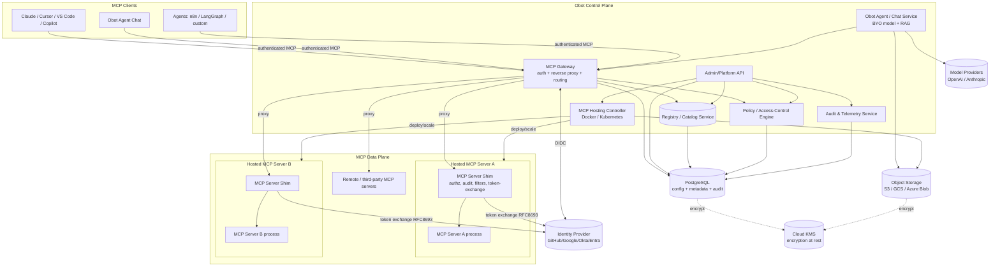
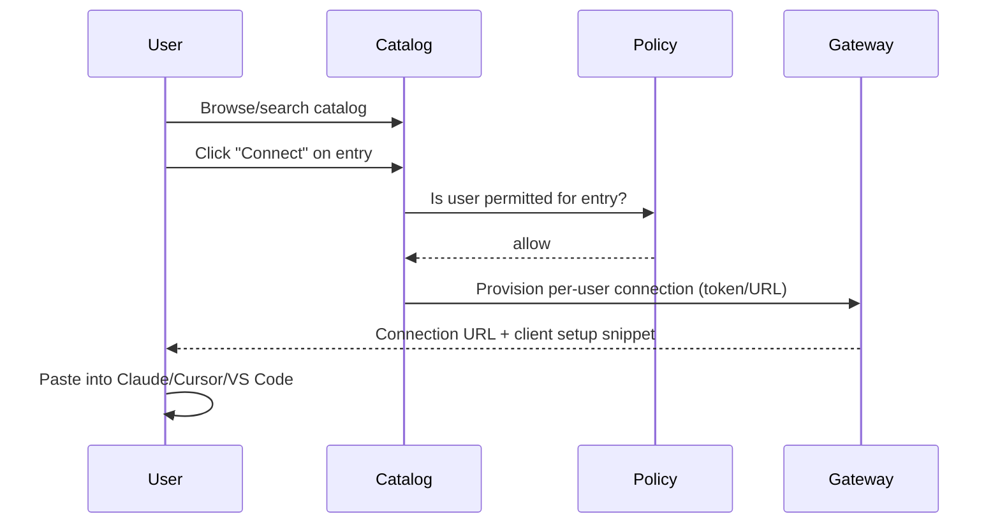
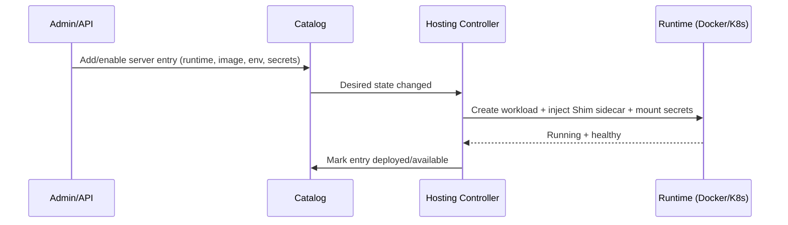
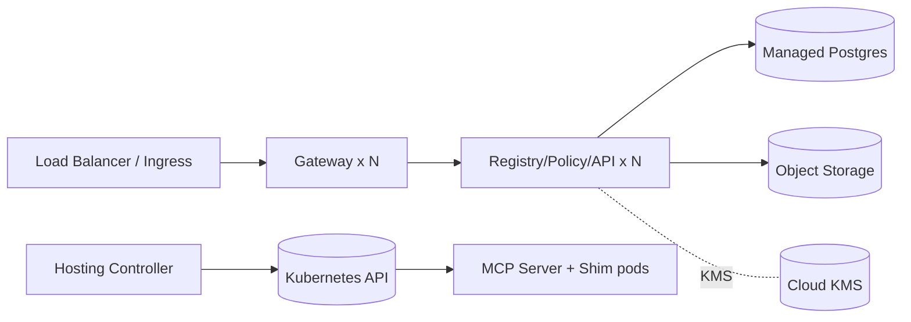

# Obot Clone — MCP Gateway SaaS: Full Recreation Specification

> **Purpose.** This document is an implementation-ready, **stack-agnostic** blueprint for recreating the
> [Obot](https://obot.ai/) product end to end — both the **marketing website** and the **MCP Gateway service/platform**.
> Emphasis is on **architecture and engineering**: components, flows, data models, API contracts, security, and
> deployment. Technology choices are presented as options; pick per your team's stack.
>
> **Source material parsed (2026-06-14):** [obot.ai](https://obot.ai/), [Obot Docs](https://docs.obot.ai/),
> [Architecture](https://docs.obot.ai/concepts/architecture/), [GitHub: obot-platform/obot](https://github.com/obot-platform/obot),
> [MCP Management Platform](https://obot.ai/mcp-management-platform/), [MCP Gateway Platform](https://obot.ai/mcp-gateway-platform/).
> Obot's own implementation is **Go (backend) + Svelte (UI) + Postgres + S3 + KMS**, deployed via Docker/Kubernetes/Helm; this
> spec abstracts that so any stack can implement it.

---

## Table of Contents

1. [Product Overview & Positioning](#1-product-overview--positioning)
2. [Personas & Top-Level Use Cases](#2-personas--top-level-use-cases)
3. [Domain Glossary & Core Concepts](#3-domain-glossary--core-concepts)
4. [System Architecture](#4-system-architecture)
5. [Component Specifications](#5-component-specifications)
6. [Key Runtime Flows](#6-key-runtime-flows)
7. [Data Model](#7-data-model)
8. [API Surface (stack-agnostic contracts)](#8-api-surface-stack-agnostic-contracts)
9. [Access Control & Policy Model](#9-access-control--policy-model)
10. [Security Architecture](#10-security-architecture)
11. [MCP Hosting Runtime](#11-mcp-hosting-runtime)
12. [Observability & Audit](#12-observability--audit)
13. [Deployment & Operations](#13-deployment--operations)
14. [Configuration Reference](#14-configuration-reference)
15. [Marketing Website Recreation](#15-marketing-website-recreation)
16. [Suggested Repository Structure](#16-suggested-repository-structure)
17. [Implementation Roadmap](#17-implementation-roadmap)
18. [Non-Functional Requirements](#18-non-functional-requirements)
19. [Open Questions / Assumptions](#19-open-questions--assumptions)

---

## 1. Product Overview & Positioning

**What it is.** An open-source **MCP (Model Context Protocol) Gateway and control plane** that lets an organization
**host, discover, secure, govern, and audit** MCP servers and AI "skills" from one place — bridging AI clients
(Claude, Cursor, VS Code, Copilot, ChatGPT, custom agents) and internal/external systems.

**Tagline.** *"The Complete Solution for Securing and Managing MCP Servers and AI Skills."*

**Core problem statement.** *"Building MCP servers or Skills is simple. OAuth, security, and ops are not."* Teams
adopt MCP fast, producing **shadow infrastructure**, unmanaged credentials, and data-leak risk. The product's job is
to *"accelerate adoption and stay in control—before the chaos spreads."*

**The four product pillars** (mirror these as top-level capabilities):

| Pillar | Responsibility |
|--------|----------------|
| **MCP Hosting** | Deploy & run MCP servers (Node.js, Python, container) over STDIO or HTTP, locally or in Kubernetes; lifecycle, scaling, isolation. |
| **MCP Registry / Catalog** | Curated, searchable index of available MCP servers/skills with metadata, docs, and visibility controls. |
| **MCP Gateway** | Single authenticated entry point: reverse-proxy that authenticates users, enforces access rules, logs every request/response, and routes to the right server. |
| **Obot Agent (Chat)** | First-party chat client over connected MCPs; bring-your-own-model (OpenAI/Anthropic), RAG, project memory, scheduled tasks. |

**Editions / business model** (replicate the tiering):
- **Open Source (self-host):** full gateway, registry, hosting, chat. Free.
- **Cloud Trial:** hosted, zero-infra trial.
- **Enterprise:** advanced IdP (Okta, Microsoft Entra), org governance, SSO/SCIM, professional support.

---

## 2. Personas & Top-Level Use Cases

| Persona | Goals | Primary surfaces |
|---------|-------|------------------|
| **Platform/IT Admin** | Deploy gateway, connect IdP, curate catalog, define access policy, monitor & audit, prevent shadow MCP. | Admin console, policy editor, audit log, fleet scanner. |
| **Developer** | Connect approved MCP servers to their AI client; build/publish internal MCP servers; manage API keys. | Catalog, connection URLs, server publishing, keys. |
| **Business user** | Discover and connect curated MCPs; use the chat client. | Catalog, one-click connect, Obot Agent chat. |
| **Security/Compliance** | Verify least-privilege, review audit trail, ensure encryption & token isolation. | Audit log, policy reports, access reviews. |

**Headline use cases**
1. Admin deploys gateway → connects GitHub/Google/Okta/Entra → imports built-in + custom servers → sets per-team policy.
2. User searches catalog → clicks "Connect" → receives an **instant connection URL** for their AI client.
3. Gateway proxies the client's MCP traffic, enforces policy, performs OAuth token exchange to downstream systems, logs everything.
4. Admin watches usage/fleet dashboards and audit logs; runs fleet scans for risky/unknown servers.

---

## 3. Domain Glossary & Core Concepts

- **MCP (Model Context Protocol):** open protocol by which AI clients consume **tools, prompts, and resources** exposed by an MCP server. Transports: **STDIO** (local process) and **Streamable HTTP/SSE** (remote).
- **MCP Client:** the consumer — Claude Desktop, Cursor, VS Code, Cline, Copilot, ChatGPT, n8n, LangGraph, or the Obot Agent.
- **MCP Server:** implements the MCP spec; exposes tools/prompts/resources. Packaged as Node.js, Python, or a container image.
- **Skill:** a higher-level, packaged capability (often a curated MCP server + config) presented to end users.
- **Catalog / Registry entry:** metadata describing a server/skill — name, description, icon, tags, runtime, env/secret requirements, required scopes, visibility, docs.
- **Connection:** a user's authorized link to a catalog entry, materialized as a per-user **connection URL** + credential the client uses.
- **Composite server:** a single logical MCP endpoint that aggregates tools from multiple backing servers.
- **MCP Server Shim:** protocol-aware sidecar deployed beside each server; owns **authorization, audit logging, webhook/filter enforcement, and OAuth token exchange**.
- **Identity Provider (IdP):** external OIDC/OAuth source of user identity (GitHub, Google, Okta, Microsoft Entra).
- **Policy / Access rule:** declarative rule binding users/groups → catalog entries → allowed tools/operations, with optional egress and rate constraints.
- **Token brokering / exchange:** the gateway/shim swaps the user's gateway token for a **downstream third-party token** via **OAuth 2.0 Token Exchange (RFC 8693)**, so the MCP server never sees raw upstream credentials.

---

## 4. System Architecture

### 4.1 Logical component diagram



### 4.2 Architectural principles

1. **Separation of authN and authZ.** The **Gateway authenticates the user** (identity only). The **Shim authorizes** the specific tool call, logs it, and performs token exchange. This keeps the blast radius small and credentials isolated.
2. **Credentials never reach the MCP server.** Token-exchange credentials live in the Shim; the MCP server only ever receives the short-lived downstream token it needs.
3. **Single control plane, distributed data plane.** Control plane = gateway/registry/policy/hosting/audit. Data plane = the Shim+server pairs (local containers or K8s pods) and remote servers.
4. **Bring-your-own-model.** No hard model dependency; configure OpenAI/Anthropic/others.
5. **GitOps-friendly config.** Catalog, policy, and provider config expressible as declarative, version-controllable artifacts.
6. **Stateless gateway, stateful stores.** Gateway/API are horizontally scalable; state lives in Postgres + object storage; secrets encrypted via KMS.

---

## 5. Component Specifications

### 5.1 MCP Gateway (edge)
- **Role.** Single authenticated entry point and **reverse proxy** for all MCP traffic.
- **Responsibilities:** terminate client connections (STDIO bridge + Streamable HTTP/SSE); authenticate the user via session/bearer token issued after IdP login; resolve the target catalog entry; ensure the target server is deployed (ask Hosting Controller if not); consult Policy Engine for a coarse allow/deny; forward to the correct **Shim** (or remote server); stream responses back; emit request/response audit events.
- **Must support:** per-user connection URLs, multi-tenant routing, composite-server fan-out, request filtering before routing, usage metering.
- **Scaling:** stateless; scale horizontally behind a load balancer; sticky sessions only if SSE requires it.

### 5.2 MCP Server Shim (sidecar, data plane)
- **Role.** Protocol-aware sidecar co-located with each MCP server.
- **Responsibilities:** **fine-grained authorization** (tool-level), **audit logging** of the actual MCP method/params/results, **webhook/filter** enforcement (pre/post call mutation or block), and **OAuth 2.0 Token Exchange (RFC 8693)** to obtain downstream third-party tokens.
- **Invariant:** downstream credentials are held only in the Shim and never exposed to the wrapped MCP server.

### 5.3 Registry / Catalog Service
- **Role.** Source of truth for available servers/skills and their metadata.
- **Responsibilities:** CRUD catalog entries; search/discovery with filters & tags; visibility scoping (per user/group/org); host built-in catalog + custom + imported entries; expose connection metadata (required scopes, env/secrets, runtime); serve docs per entry.

### 5.4 Policy / Access-Control Engine
- **Role.** Decide who can use which entry and which tools.
- **Responsibilities:** evaluate rules binding subjects (user/group/role) → resources (catalog entry, tool) → actions; support network **egress** policies, **model-access** policies, rate limits; provide decision API to Gateway (coarse) and Shim (fine). See [§9](#9-access-control--policy-model).

### 5.5 MCP Hosting Controller
- **Role.** Lifecycle manager for hosted MCP servers.
- **Responsibilities:** build/run server workloads (Docker locally or K8s in production), inject the Shim sidecar, mount config/secrets, manage start/stop/scale/health, support STDIO and HTTP server types, isolate tenants. Reconciles desired state from the catalog (controller/operator pattern).

### 5.6 Admin/Platform API
- **Role.** Backbone for the admin console and automation.
- **Responsibilities:** manage IdP connections, catalog, policies, users/groups, API keys, model providers, and read audit/usage. See [§8](#8-api-surface-stack-agnostic-contracts).

### 5.7 Obot Agent / Chat Service
- **Role.** First-party MCP client + chat UI.
- **Responsibilities:** converse using a configured model; call connected MCP tools through the Gateway; **RAG** over user-supplied docs; **project memory**; **scheduled/automated tasks**; multi-provider model selection.

### 5.8 Identity Broker
- **Role.** Federate org IdPs and issue gateway sessions/tokens.
- **Responsibilities:** OIDC/OAuth login with GitHub/Google/Okta/Entra; map external identity → internal user + group memberships; issue gateway access tokens; support bootstrap admin token for first-run.

### 5.9 Stores
- **PostgreSQL** — configuration, metadata, policy, users/groups, audit records. *Externally hosted in production.*
- **Object storage (S3/GCS/Azure Blob/S3-compatible)** — workspace/agent/RAG data; defaults to local disk in dev.
- **Cloud KMS** — envelope encryption for secrets/data at rest; pluggable provider.

---

## 6. Key Runtime Flows

### 6.1 User login (identity)
```mermaid
sequenceDiagram
  participant U as User
  participant GW as Gateway/Identity Broker
  participant IDP as Identity Provider
  U->>GW: Access console / request connection
  GW->>IDP: OIDC auth redirect
  IDP-->>GW: Authorization code
  GW->>IDP: Exchange code -> ID/access token
  GW->>GW: Map identity -> user + groups; issue gateway session token
  GW-->>U: Authenticated session (+ connection URLs)
```

### 6.2 MCP request with authorization + token exchange
```mermaid
sequenceDiagram
  participant C as MCP Client
  participant GW as MCP Gateway
  participant POL as Policy Engine
  participant SH as MCP Server Shim
  participant SR as MCP Server
  participant IDP as IdP / Token Service
  participant EXT as Downstream system

  C->>GW: MCP call (tools/call) + gateway token
  GW->>GW: Validate user/session
  GW->>POL: Coarse decision (user, entry)
  POL-->>GW: allow
  GW->>SH: Proxy MCP request
  SH->>POL: Fine decision (user, tool, args)
  POL-->>SH: allow
  SH->>IDP: Token Exchange (RFC 8693): gateway token -> downstream token
  IDP-->>SH: Downstream access token
  SH->>SR: Forward MCP call (with scoped token if needed)
  SR->>EXT: Perform action
  EXT-->>SR: Result
  SR-->>SH: MCP result
  SH->>SH: Audit log (method, params, outcome); apply post-filters
  SH-->>GW: Result
  GW-->>C: Streamed MCP response
```

### 6.3 Connect-to-catalog (instant connection URL)


### 6.4 Hosting reconciliation


---

## 7. Data Model

Core entities (relational; names illustrative):

```
Organization(id, name, plan, created_at)
User(id, org_id, external_subject, idp, email, display_name, status, created_at)
Group(id, org_id, name, source)               -- mirrored from IdP or local
UserGroup(user_id, group_id)

IdentityProvider(id, org_id, type[github|google|okta|entra], client_id, config_json, enabled)
ApiKey(id, org_id, owner_user_id, name, hash, scopes_json, last_used_at, expires_at)

CatalogEntry(id, org_id, slug, name, description, icon_url, tags_json,
             runtime[node|python|container|remote], transport[stdio|http],
             image_or_command, env_schema_json, required_scopes_json,
             visibility[org|group|user], is_composite, docs_md, version, created_at)
CompositeMember(composite_entry_id, member_entry_id, tool_prefix)

ServerDeployment(id, entry_id, status, endpoint_url, shim_endpoint, replicas, health, updated_at)
Connection(id, user_id, entry_id, connection_token_hash, url, status, created_at, revoked_at)

Policy(id, org_id, name, description, enabled, priority)
PolicyRule(id, policy_id, effect[allow|deny],
           subject_json{users,groups,roles}, resource_json{entries,tools},
           action_json{operations}, constraints_json{egress,rate,model})

ModelProvider(id, org_id, type[openai|anthropic|...], config_secret_ref, default_bool)
Secret(id, org_id, name, kms_key_ref, ciphertext, created_at)         -- envelope-encrypted

AuditEvent(id, org_id, ts, actor_user_id, source_ip, gateway_request_id,
           entry_id, tool, mcp_method, decision[allow|deny], status,
           params_redacted_json, result_summary, latency_ms)
UsageMetric(id, org_id, entry_id, user_id, window_start, calls, tokens, bytes)

AgentProject(id, org_id, owner_user_id, name, memory_ref, model_provider_id)
AgentDocument(id, project_id, object_key, embedding_ref)               -- RAG corpus
ScheduledTask(id, project_id, cron, prompt, enabled, last_run_at)
```

**Notes**
- Secrets are **envelope-encrypted**: `Secret.ciphertext` encrypted with a data key wrapped by KMS (`kms_key_ref`).
- `AuditEvent.params_redacted_json` stores redacted args (policy-driven redaction of sensitive fields).
- `Group.source` distinguishes IdP-synced vs locally defined groups.

---

## 8. API Surface (stack-agnostic contracts)

Expose a versioned REST/JSON admin API (`/api/v1/...`) plus the MCP proxy endpoints. Representative endpoints:

**Auth & identity**
```
POST   /api/v1/auth/login/{provider}      -> redirect/callback (OIDC)
POST   /api/v1/auth/bootstrap             -> first-run admin via OBOT_BOOTSTRAP_TOKEN
GET    /api/v1/me                         -> current user + groups + permissions
POST   /api/v1/identity-providers         -> configure IdP (admin)
```

**Catalog / registry**
```
GET    /api/v1/catalog?query=&tag=&visibility=
POST   /api/v1/catalog                    -> create entry (admin)
GET    /api/v1/catalog/{id}
PUT    /api/v1/catalog/{id}
DELETE /api/v1/catalog/{id}
POST   /api/v1/catalog/{id}/composite     -> define composite members
```

**Connections**
```
POST   /api/v1/connections                -> {entryId} => {connectionUrl, clientSnippet}
GET    /api/v1/connections                 (current user)
DELETE /api/v1/connections/{id}            -> revoke
```

**Policies & access**
```
GET    /api/v1/policies
POST   /api/v1/policies
PUT    /api/v1/policies/{id}
POST   /api/v1/policies/evaluate          -> {subject,resource,action} => {decision,reason}
```

**Hosting**
```
GET    /api/v1/deployments
POST   /api/v1/deployments/{entryId}/start|stop|restart|scale
GET    /api/v1/deployments/{entryId}/health|logs
```

**Model providers & keys**
```
GET/POST /api/v1/model-providers
GET/POST /api/v1/api-keys
DELETE   /api/v1/api-keys/{id}
```

**Audit & usage**
```
GET    /api/v1/audit?from=&to=&user=&entry=&decision=
GET    /api/v1/usage?window=&entry=&user=
```

**MCP proxy (data plane)**
```
ALL    /mcp/{entrySlug}                    -> Streamable HTTP/SSE MCP endpoint (per-connection auth)
                                            (STDIO clients use a local bridge that tunnels to this)
```

**Agent / chat**
```
POST   /api/v1/agent/projects
POST   /api/v1/agent/projects/{id}/chat   -> streamed completion; tool calls routed via gateway
POST   /api/v1/agent/projects/{id}/documents   -> RAG ingest
POST   /api/v1/agent/projects/{id}/tasks       -> scheduled task
```

All admin endpoints require a session or API key; all responses carry `gateway_request_id` for audit correlation.

---

## 9. Access Control & Policy Model

**Model:** attribute-aware RBAC with explicit allow/deny rules and constraints.

- **Subjects:** users, groups (IdP-synced or local), roles (`admin`, `developer`, `user`).
- **Resources:** catalog entries and, at fine grain, **individual tools** within a server.
- **Actions:** `connect`, `invoke-tool`, `read-resource`, `manage`.
- **Effects:** `allow` / `deny`; deny overrides; rules ordered by `priority`.
- **Constraints:**
  - **Tool-level permissions** — allow only a subset of a server's tools.
  - **Network egress control** — restrict which downstream hosts a server may reach.
  - **Model access policies** — which model providers/models a user/group may use.
  - **Rate limits / quotas** — per user/entry.
- **Evaluation points:** Gateway performs a **coarse** entry-level check; Shim performs the **fine** tool/argument-level check at call time.

Example rule (JSON):
```json
{
  "effect": "allow",
  "subject": { "groups": ["engineering"] },
  "resource": { "entries": ["github-mcp"], "tools": ["list_repos", "create_issue"] },
  "action": { "operations": ["connect", "invoke-tool"] },
  "constraints": { "egress": ["api.github.com"], "rate": { "perMinute": 60 } }
}
```

---

## 10. Security Architecture

- **AuthN:** **OAuth 2.1 / OIDC** via external IdP (GitHub, Google, Okta, Entra). Gateway issues short-lived session tokens; API keys for programmatic access.
- **AuthZ:** policy engine (coarse at gateway, fine at shim).
- **Token brokering:** **OAuth 2.0 Token Exchange (RFC 8693)** in the Shim to mint downstream third-party tokens on demand. **Credentials never exposed to the MCP server.**
- **Encryption in transit:** TLS everywhere (client↔gateway, gateway↔shim, shim↔downstream).
- **Encryption at rest:** **envelope encryption via cloud KMS** for secrets and sensitive data in Postgres/object storage; pluggable KMS provider.
- **Audit:** comprehensive, immutable-ish audit log of MCP requests/responses and admin actions; redaction of sensitive params.
- **Tenant isolation:** per-tenant routing, workload isolation, and data scoping by `org_id`.
- **Secrets handling:** secrets referenced by `kms_key_ref`; only decrypted in-memory in the Shim/controller at use time.
- **Shadow-MCP prevention:** fleet scanning to discover unmanaged/unknown MCP servers and bring them under governance.

---

## 11. MCP Hosting Runtime

- **Server packaging:** Node.js, Python, or container image; declared per catalog entry.
- **Transports:** **STDIO** (process-local; bridged) and **Streamable HTTP/SSE** (network).
- **Sidecar injection:** every hosted server runs with an **MCP Server Shim** in the same pod/network namespace.
- **Runtimes:** **Docker** for local/dev (`-v /var/run/docker.sock` to manage child containers); **Kubernetes** for production (Helm chart; one Deployment/Pod per server + Shim).
- **Lifecycle:** controller reconciles desired (catalog) vs actual (running) state — create, health-check, scale, stop, GC.
- **Remote servers:** entries may point at external MCP endpoints; the gateway proxies and the policy/audit still apply (Shim features that require co-location degrade gracefully or run as an egress proxy).
- **Composite servers:** a virtual entry aggregates tools from multiple backing servers, namespacing tool names.

---

## 12. Observability & Audit

- **Audit events** for every MCP call (actor, entry, tool, method, decision, status, latency, redacted params) and every admin mutation.
- **Usage analytics:** calls/tokens/bytes per entry/user/time window; "which servers are being used."
- **Operational telemetry:** metrics (request rate, error rate, latency, deployment health), structured logs, distributed tracing keyed by `gateway_request_id`.
- **Dashboards:** fleet view, usage, audit search/filter, per-deployment health & logs.
- **Fleet scanning:** periodic discovery of MCP servers across the environment to flag unmanaged ones.

---

## 13. Deployment & Operations

**Single-container quickstart (dev) — pattern from upstream:**
```bash
docker run -d --name obot-clone -p 8080:8080 \
  -v /var/run/docker.sock:/var/run/docker.sock \
  -e OPENAI_API_KEY=<key> \
  -e OBOT_BOOTSTRAP_TOKEN=<min-8-chars> \
  <your-registry>/obot-clone:latest
# UI at http://localhost:8080
```

**Production (Kubernetes):**
- Helm chart deploys gateway/API/registry/policy/hosting-controller/agent as scalable services.
- **External Postgres** (managed), **object storage** (S3/GCS/Azure), and **KMS** are required dependencies.
- Hosting controller runs as an operator/controller with RBAC to create per-server Deployments + Shim sidecars.
- Horizontal scaling for stateless gateway/API; HPA on CPU/RPS.
- Blue/green or rolling upgrades; DB migrations gated at startup.

**Topology (prod):**


---

## 14. Configuration Reference

Environment variables (names mirror upstream where known; extend as needed):

| Variable | Purpose | Notes |
|----------|---------|-------|
| `OPENAI_API_KEY` / `ANTHROPIC_API_KEY` | Model provider credential | at least one for the Agent |
| `OBOT_BOOTSTRAP_TOKEN` | First-run admin credential | min length (≥6–8 chars) |
| `OBOT_SERVER_ENABLE_AUTHENTICATION` | Toggle IdP auth | `true` in any shared/prod env |
| `DATABASE_URL` | Postgres DSN | external in prod |
| `OBJECT_STORE_*` | S3/GCS/Azure config | bucket, region, creds/role |
| `KMS_PROVIDER` / `KMS_KEY_ID` | At-rest encryption | pluggable provider |
| `IDP_*` | IdP client id/secret/issuer | per provider (GitHub/Google/Okta/Entra) |
| `PORT` | HTTP listen port | default `8080` |

Declarative config (GitOps): catalog entries, policies, IdP and model-provider definitions stored as version-controlled YAML/JSON and reconciled on deploy.

---

## 15. Marketing Website Recreation

Recreate the public site as a separate front-end app. Architecture-light but content-complete.

### 15.1 Information architecture / navigation
- **Primary nav:** `MCP Catalog`, `Learning Center` (MCP 101, Enterprise MCP, Agentic AI Security, AI Development), `Resources` (Blog, Docs, Discord, GitHub, eBooks, Open Source, YouTube), `About Us`, `Contact Us`.
- **Persistent CTAs:** *Try Obot Now*, *Schedule a Demo*, *View on GitHub*.
- **Social:** Discord, GitHub, X/Twitter, YouTube, LinkedIn, Instagram.

### 15.2 Landing page sections (in order)
1. **Hero** — headline *"The Complete Solution for Securing and Managing MCP Servers and AI Skills"*; subhead on OAuth/security/ops being the hard part; CTAs *Try Obot for Free* + *View on GitHub*.
2. **Problem framing** — *"Building MCP servers or Skills is simple. OAuth, security, and ops are not."* / *"accelerate adoption and stay in control—before the chaos spreads."*
3. **Four pillars** — Hosting, Registry, Gateway, Chat (card grid w/ icons).
4. **Feature callouts** — OAuth for all servers, IdP integration, fine-grained access, audit logging, GitOps, universal hosting/proxying, catalog discovery, composite servers, egress control, token brokering, instant connection URLs, fleet scanning, custom branding.
5. **How it works (6 steps)** — Admin setup → Catalog config → Access control → User discovery/connect → Intelligent routing/hosting → Full visibility/control.
6. **Integrations** — IdPs (GitHub/Google/Okta/Entra); MCP servers (Outlook/Slack/Notion/GitHub); clients (Claude/Cursor/VS Code/Cline/Copilot); services (Zapier/AWS).
7. **Editions / pricing** — Open Source, Cloud Trial, Enterprise.
8. **Social proof / community** — Discord, conferences (MCP Dev Summit, AGNTCon, Ai4), workshops.
9. **Resources teaser** — blog (70+ articles), docs, eBooks, YouTube.
10. **Footer** — full link map + social + legal.

### 15.3 Design system (replicate the aesthetic)
- **Theme:** dark, modern B2B SaaS; white/light logo on dark background; high-contrast accents.
- **Layout:** card-based feature grids; generous spacing; expandable/accordion sections in the Learning Center.
- **Iconography:** one icon per feature callout.
- **Typography:** clean geometric/grotesque sans for headings + readable sans body. (Capture exact fonts/colors from the live CSS during build; define tokens: `--bg`, `--surface`, `--text`, `--accent`, `--muted`, radius, shadow, spacing scale.)
- **Content surfaces:** MDX-driven blog/docs/learning center; static-site or SSR framework of choice (stack-agnostic).

> When building, pull the live page's computed CSS to lock exact hex values, font families, and spacing — this spec captures structure and copy, not pixel values.

---

## 16. Suggested Repository Structure

Mirrors upstream's separation (polyglot-friendly, but tech-neutral):

```
/                      # root: Makefile, license, CI, release config
  apiclient/           # generated/admin API client library
  chart/               # Helm chart for Kubernetes deployment
  cmd/ or src/         # service entrypoints (gateway, api, controller, agent)
  pkg/ or internal/    # core packages: registry, policy, hosting, audit, auth, shim
  shim/                # MCP Server Shim sidecar
  ui/                  # web console (admin) + Obot Agent chat UI
  website/             # marketing site (separate app)
  docs/                # product + ops documentation
  tools/               # tooling utilities
  deploy/              # docker-compose, k8s manifests, examples
```

---

## 17. Implementation Roadmap

**Phase 0 — Foundations:** repo, CI, base service skeletons, Postgres schema, KMS abstraction, config loader, bootstrap-token admin.

**Phase 1 — Identity + Gateway MVP:** OIDC login (GitHub/Google), gateway reverse-proxy for a single remote MCP server, session tokens, basic audit log.

**Phase 2 — Catalog + Connections:** registry CRUD, search, per-user connection URLs + client snippets, admin console shell.

**Phase 3 — Hosting Controller:** Docker runtime, deploy Node/Python/container servers, **Shim sidecar** with tool-level authz + audit.

**Phase 4 — Policy Engine:** allow/deny rules, tool-level perms, egress + rate constraints; coarse (gateway) + fine (shim) evaluation.

**Phase 5 — Token Exchange (RFC 8693):** downstream OAuth token brokering in the Shim; credential isolation.

**Phase 6 — Obot Agent:** chat UI, BYO model, MCP tool calling via gateway, RAG ingest, project memory, scheduled tasks.

**Phase 7 — Enterprise + scale:** Okta/Entra, SSO/SCIM, Kubernetes/Helm, composite servers, fleet scanning, usage dashboards, custom branding.

**Phase 8 — Marketing site:** pages, design system, blog/docs/learning center, pricing, CTAs.

---

## 18. Non-Functional Requirements

- **Security:** least-privilege by default; deny-by-default policies; encrypted secrets; full audit trail; credential isolation.
- **Scalability:** stateless gateway/API scale horizontally; one Shim per server; Postgres + object storage externalized.
- **Availability:** rolling/blue-green upgrades; health checks; graceful degradation when a server is down.
- **Performance:** low added proxy latency; streaming (SSE) without buffering whole responses.
- **Multi-tenancy:** strict `org_id` scoping across data and routing.
- **Extensibility:** pluggable IdP, model provider, KMS, object store, runtime (Docker/K8s).
- **Compliance:** audit retention, data residency options, redaction controls.
- **Portability:** self-host (OSS), cloud trial, enterprise — same core, gated features.

---

## 19. Open Questions / Assumptions

Assumptions made while writing (validate before build):
1. **Exact visual tokens** (hex colors, font families, spacing) are **not** captured here — pull from the live site's CSS at build time. This spec captures IA, copy, and structure.
2. **STDIO transport** for remote/hosted servers is bridged via a local client helper; exact bridge protocol is implementation-defined.
3. **Shim co-location for remote third-party servers**: where co-location isn't possible, Shim features (token exchange, fine authz) run as an egress proxy in front of the remote server — confirm acceptable.
4. **Audit immutability** level (append-only table vs WORM storage) is a deployment choice; spec assumes append-only with retention.
5. **Pricing specifics** (seat/usage tiers, limits) are not published in detail; the edition tiers are modeled, exact limits TBD.
6. **Group sync** (SCIM vs JIT from IdP claims) — both modeled; pick per IdP capabilities.

---

*End of specification. Built from public sources on 2026-06-14; verify against the live product and upstream repo before implementation.*
