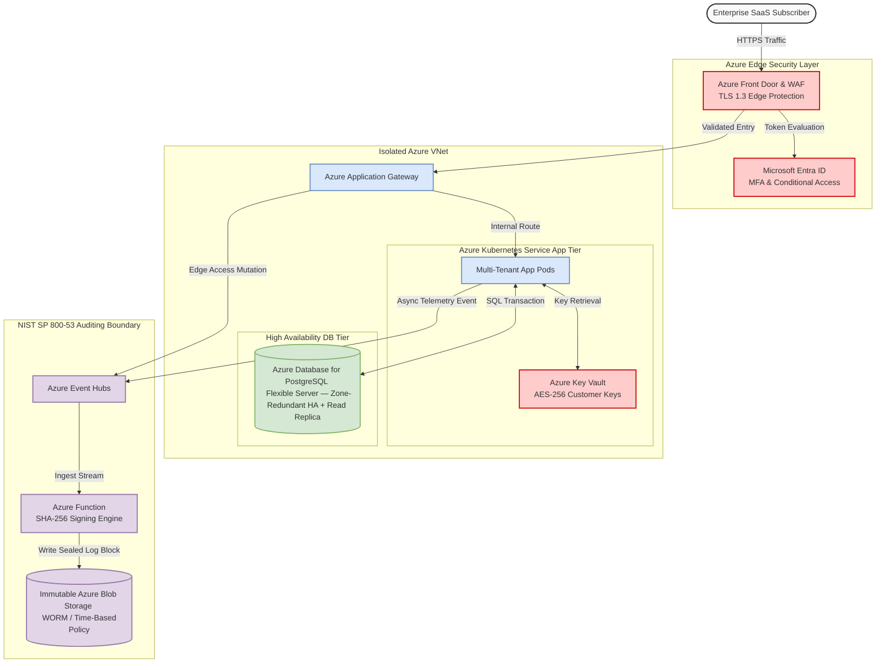

# Doxa Enterprise System Architecture & Compliance Specification (Azure Environment)

## 1. Executive Summary & Core Pillars

Doxa Enterprise is a multi-tenant, subscription-based Software-as-a-Service (SaaS) platform built for
highly regulated industries. This document outlines our implementation patterns tailored specifically
for the Microsoft Azure platform, ensuring rigorous tenant isolation, automated regulatory guardrails,
and cloud resilience.

### Core Architectural Pillars

- **High Availability (HA):** Engineered for **99.99% uptime** (Four Nines) across Azure Availability
  Zones.[^1]
- **Zero-Trust Security:** Strict identity verification via Microsoft Entra ID and continuous network
  security filtering.
- **Absolute Data Privacy:** Cryptographic separation of sensitive data-at-rest and data-in-transit.
- **Continuous Compliance:** Perpetual validation of SOC 2 Type II and HIPAA certifications using
  automated cloud governance.

---

## 2. Compliance Frameworks & Safeguards

### 2.1 SOC 2 Type II (AICPA Trust Services Criteria)

Platform architecture continuously maps operational procedures to the AICPA Trust Services Criteria
(TSC) via the Azure Policy SOC 2 Regulatory Compliance Built-in Initiative:[^2]

- **`CC6.0` (Access Control):** Enforced at the perimeter using Azure Web Application Firewall (WAF)
  coupled with Microsoft Entra ID conditional access policies.
- **`CC7.0` (System Operations):** Managed using Microsoft Defender for Cloud[^3] for continuous
  vulnerability scanning, container security posture monitoring, and rapid threat detection.

### 2.2 HIPAA Technical Safeguards (45 CFR § 164.312)

To legally handle Electronic Protected Health Information (ePHI) under our executed Microsoft Azure
Business Associate Agreement (BAA),[^4] Doxa implements controls mapped to the Azure Policy
HIPAA/HITRUST Regulatory Initiative:[^5]

- **`§ 164.312(a)` Access Control:** Enforced through Microsoft Entra ID Unique User Identification
  and short-lived session token lifetimes.
- **`§ 164.312(b)` Audit Controls:** Centralized log collection across all cloud layers into an Azure
  Log Analytics Workspace.
- **`§ 164.312(c)` Integrity:** Automated checks via Azure File/Blob integrity monitoring and
  immutable snapshot validation.
- **`§ 164.312(e)` Transmission Security:** Mandated encryption across all public network perimeters
  and secure inter-VNet routing.

---

## 3. Security & Privacy Architecture

### 3.1 Cryptographic Standards

- **Data-at-Rest:** All persistent storage layers — including database volumes, caches, and file
  objects — are encrypted via **`AES-256`** utilizing customer-managed keys (CMK) secured inside
  Azure Key Vault. Keys automatically rotate every 90 days.
- **Data-in-Transit:** Public entry points and internal app-to-app communication require **`TLS 1.3`**.
  Legacy handshakes (TLS 1.0, 1.1, 1.2) are programmatically dropped at the Azure Application Gateway
  layer.

### 3.2 Access Control & Network Isolation

- **Authentication & Authorization:** Microsoft Entra ID dictates fine-grained Role-Based Access
  Control (RBAC).[^6] Cross-tenant communication is explicitly blocked.
- **Tenant Data Isolation:** In production each subscriber's data resides in its **own PostgreSQL
  database** (database-per-tenant); stateless application pods resolve a per-tenant connection at
  runtime, and multiple pods run in parallel against distinct tenant databases. During the development
  cycle a **single shared PostgreSQL database** is used, with isolation enforced at the **row level**
  (`TenantId` column + Row-Level Security). See
  [../plan/multi-tenant-cicd-data-isolation-architecture-plan.md](../plan/multi-tenant-cicd-data-isolation-architecture-plan.md).
- **Network Segmentation:** Deployed inside an Azure Virtual Network (VNet) topology.[^7] Core compute
  tasks run on private subnets isolated by Network Security Groups (NSGs),[^8] admitting public
  network inputs exclusively from authenticated Azure WAF endpoints.

---

## 4. High Availability & Disaster Recovery (DR)

### 4.1 Target Metrics

- **Recovery Time Objective (`RTO`):** < 1 hour.
- **Recovery Point Objective (`RPO`):** < 1 minute.

### 4.2 Infrastructure Topography

- **Multi-Region Deployment:** Active-passive **priority failover** across paired primary Azure
  Regions — `East US 2` (priority 1, primary) and `Central US` (priority 2, failover target) —
  utilizing Azure Front Door for global traffic routing and instant health-probe-driven failover.
  (See the Front Door topology in
  [../plan/enterprise-resilience-application-security-blueprint.md](../plan/enterprise-resilience-application-security-blueprint.md).)
- **Compute Tier:** Microservices run in an Azure Kubernetes Service (AKS) cluster distributed across
  multiple regional Availability Zones. Auto-scaling groups adjust node capacity when aggregate
  cluster CPU or memory utilization hits 70%.
- **Database Tier:** Geo-replicated **Azure Database for PostgreSQL Flexible Server** (Business-critical
  / Memory-Optimized compute) with **zone-redundant high availability** and cross-region **read
  replicas**,[^9] using a synchronous standby plus streaming replication to fulfill the strict
  sub-minute `RPO` mandate.

> **Data tier — current vs. target.** During the development cycle the platform runs **containerized
> PostgreSQL** (provisioned by .NET Aspire alongside Redis and Keycloak). Once the application exits
> its development cycle, the data tier migrates to **Azure Database for PostgreSQL Flexible Server**;
> the managed-service references throughout this document describe that production target.

---

## 5. Immutable Transaction Auditing (NIST SP 800-53 Rev. 5)

To ensure that all organizational interactions are independently auditable, Doxa separates the audit
pipeline from application state databases following the NIST **AU (Audit and Accountability)** control
guidelines:

```text
        [User / System Action]
                  │
                  ▼
   [Azure App Gateway / Event Hubs]
                  │
                  ▼
    [Azure Function Audit Worker]
                  │
                  ▼
       [Cryptographic Signing]
                  │
                  ▼
      [Immutable Storage: Azure Blob]
      [With Time-Based Retention Policy]
```

### 5.1 Audit Pipeline Requirements

- **Decoupled Architecture:** Audit event captures run asynchronously via Azure Event Hubs, protecting
  the responsiveness of standard user transaction pathways.
- **Cryptographic Signatures:** Every transaction log entry is signed in chronological order with
  `SHA-256` block hashing, generating an unalterable, linked audit ledger.
- **WORM Preservation:** Final logs are pushed directly to an Azure Blob Storage container configured
  with an Immutable Storage Time-Based Retention Policy.[^10]
- **Tamper Prevention:** System actions are locked under a strict "legal hold" status. No application
  tier, tenant identity, or subscription admin possesses the privileges needed to modify or delete
  logs within the compliance archival window.

---

## 6. Technical Architecture Diagram

This structural overview highlights perimeter defenses, data storage layers, and the append-only audit
validation pipeline configured within Microsoft Azure.



---

## Footnotes / Reference Links

[^1]: [Azure Availability Zones Infrastructure](https://learn.microsoft.com/azure/reliability/availability-zones-overview) — Technical documentation on building resilient regional applications.
[^2]: [Azure Policy SOC 2 Built-in Initiative Details](https://learn.microsoft.com/azure/governance/policy/samples/soc-2) — Structural details regarding built-in cloud compliance mapping for compliance teams.
[^3]: [Microsoft Defender for Cloud Security Standards](https://learn.microsoft.com/azure/defender-for-cloud/defender-for-cloud-introduction) — Overview of infrastructure runtime verification and platform posture checks.
[^4]: [Microsoft Trust Center Regulatory Compliance Overview](https://learn.microsoft.com/compliance/regulatory/offering-hipaa-hitech) — Official portal instructions for retrieving independent cloud audit findings and BAA agreements.
[^5]: [Azure Policy HIPAA/HITRUST Built-in Initiatives](https://learn.microsoft.com/azure/governance/policy/samples/hipaa-hitrust) — Control mappings establishing technical cloud accountability for medical workloads.
[^6]: [Azure Resource Manager Role-Based Access Control](https://learn.microsoft.com/azure/role-based-access-control/overview) — Framework patterns managing modern enterprise permissions.
[^7]: [Azure Virtual Network Topography and Hub Architecture](https://learn.microsoft.com/azure/architecture/networking/architecture/hub-spoke) — Structural design rules handling enterprise routing scale limits safely.
[^8]: [Azure Network Security Group Configurations](https://learn.microsoft.com/azure/virtual-network/network-security-groups-overview) — Reference limits regarding granular incoming/outgoing security policies.
[^9]: [High availability in Azure Database for PostgreSQL — Flexible Server](https://learn.microsoft.com/azure/postgresql/flexible-server/concepts-high-availability) — Zone-redundant HA, standby failover, and read-replica patterns for high-performing, stateful cloud databases.
[^10]: [Azure Immutable Blob Storage (WORM) Time-Based Retention](https://learn.microsoft.com/azure/storage/blobs/immutable-storage-overview) — Guidelines for storing legally binding transaction events in a write-once, read-many state.
